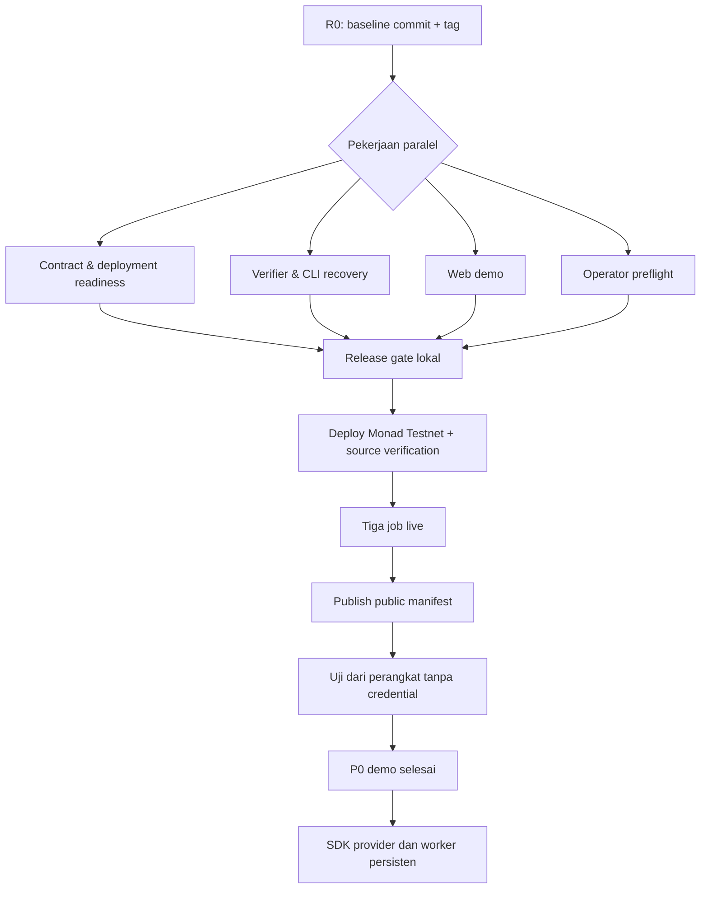

# XYX Monad — alur kerja dan pembagian implementator

Dokumen ini mengubah backlog P0 dalam [PRD Monad](XYX_MONAD_PRD.md) dan [blueprint](XYX_MONAD_BLUEPRINT.md) menjadi pekerjaan yang dapat diberi kepada beberapa implementator tanpa saling menimpa kode. Fokusnya adalah menyelesaikan demo Monad Testnet yang dapat diperiksa publik, bukan menambah fitur lama dari Arc.

## 1. Kondisi awal dan hasil yang dituju

Kode lokal sudah mempunyai escrow, evaluator EIP-712, verifier payout/settlement, manifest IPFS publik, CLI demo, dan halaman `/demo`. Semua ini sudah lolos gate lokal yang dicatat di blueprint. Ini **belum** berarti ada deployment atau demo live.

P0 selesai hanya jika tiga job Monad Testnet yang berbeda dapat diverifikasi tanpa kredensial operator:

1. transfer payout benar lalu reward dibayar ke provider;
2. transfer payout salah lalu reward dikembalikan ke buyer;
3. job kedaluwarsa lalu reward dikembalikan ke buyer tanpa verdict.

Untuk setiap job, penonton harus bisa membuka manifest publik, spec/evidence IPFS, transaksi, receipt, state akhir, dan log USDC settlement. Tidak ada worker, SDK agen, marketplace, subgraph, ERC-8004, atau wallet flow browser yang menjadi syarat demo P0.

## 2. Satu keputusan yang wajib dibuat sebelum paralel

Worktree saat ini berisi rewrite besar dari proyek lama ke Monad, termasuk penghapusan banyak file Arc dan file Monad yang belum dilacak. Karena itu maintainer/release owner harus lebih dulu membuat **satu baseline commit yang direview** dari kondisi Monad saat ini, lalu memberi tag, misalnya `monad-p0-baseline`.

Baseline itu harus berisi source Monad, penghapusan source Arc yang memang disengaja, PRD, blueprint, lockfile, dan hasil empat gate. Jangan memasukkan `.env`, private key, output `.next`, cache, atau run record yang berisi data sensitif.

Setiap implementator membuat branch dari tag tersebut. Tanpa baseline, reviewer tidak dapat membedakan perubahan baru dari rewrite sebelumnya dan konflik merge akan membesar.



## 3. Peran dan hak akses

| Peran | Jumlah | Memegang | Tidak boleh dilakukan |
| --- | ---: | --- | --- |
| Release owner | 1 | baseline, keputusan PRD, merge, release checklist | mengubah invariant atau deployment diam-diam |
| Implementator kontrak | 1 | `packages/contracts/**`, deployment-preflight | broadcast memakai key produksi/testnet orang lain |
| Implementator protocol | 1 | `packages/monad/**`, `scripts/**`, test protocol | mengubah ABI kontrak tanpa koordinasi |
| Implementator web | 1 | `apps/web/**`, tes/build UI | menyimpan key/RPC secret di browser |
| Chain operator | 1, dapat dirangkap release owner | `.env` lokal, keystore, Pinata upload credential, broadcast | memberi secret ke branch, log, manifest, atau chat |
| Implementator pasca-P0 | 0–1 | SDK/worker setelah A8 | mulai sebelum proof live P0 ada |

Empat alamat operasional minimum tetap terpisah: buyer, provider, attestor, dan relayer. Deployer, admin, dan pauser juga dicatat terpisah pada record deployment. Chain operator satu-satunya pihak yang mengirim transaksi live; implementator menyiapkan kode dan command yang dapat direview.

Jika hanya tersedia tiga implementator, gabungkan **kontrak** dan **release** pada orang yang sama. Jangan gabungkan protocol dan web pada branch yang sama selama P0 karena keduanya akan sering berubah dan sulit direview.

## 4. Pembagian pekerjaan P0

### R0 — Baseline dan release control

**Owner:** release owner. **Dikerjakan lebih dulu.**

| Item | Tindakan | Bukti selesai |
| --- | --- | --- |
| R0.1 | Review diff rewrite Monad, pastikan tidak ada runtime Arc, secret, cache, atau artefak deployment lama yang ikut baseline. | Baseline commit dan tag yang dapat di-clone. |
| R0.2 | Jalankan `npm run test:contracts`, `npm test`, `npm run typecheck`, dan `npm run build:web`. | Output empat command dicatat di PR/CI. |
| R0.3 | Buat issue board memakai ID dalam dokumen ini dan tetapkan satu owner per ID. | Tidak ada dua owner untuk file yang sama. |
| R0.4 | Review perubahan ABI, schema, atau PRD sebelum merge. | Catatan keputusan singkat bila ada perubahan material. |

**Batas file:** semua file hanya untuk baseline; sesudah baseline, release owner tidak mengedit source workstream lain kecuali saat merge conflict.

### C1 — Hardening kontrak dan tes keamanan

**Owner:** implementator kontrak. **Branch:** `feat/c1-contract-hardening`.

**Scope:** `packages/contracts/src/**`, `packages/contracts/test/**`, dan dokumentasi kontrak yang terkait. Kontrak sekarang sudah meliputi lifecycle P0; pekerjaan ini menutup tes risiko yang belum dibuktikan, bukan menulis ulang arsitektur.

| Subtask | Hasil yang dibuat | Kriteria penerimaan |
| --- | --- | --- |
| C1.1 | Tambah tes untuk domain EIP-712 dengan verifying contract salah, signer tanpa role, role dicabut, pause/unpause, batas waktu verdict, dan nonce/digest replay. | Semua jalur invalid revert dan tidak mengonsumsi nonce/digest bila transaksi revert. |
| C1.2 | Tambah tes token yang revert/false return dan reentrancy bila mock yang tepat dapat dibuat tanpa memalsukan perilaku USDC. | Dana escrow dan status job tidak korup saat transfer gagal atau callback menyerang. |
| C1.3 | Tambah invariant/property test ringkas untuk total reward job funded versus saldo escrow dan ketidakmungkinan settlement dua kali. | Bukti test meliputi `Completed`, `Rejected`, dan `Expired`. |
| C1.4 | Tinjau event, custom error, constructor arg, dan ABI terhadap PRD. Bila ABI berubah, tulis alasan dan beri tahu semua owner sebelum merge. | Tidak ada perubahan semantik diam-diam; source dan test lulus. |

**Keluar dari scope:** upgrade proxy, banyak token, fee, hooks, dispute manual, dan perubahan lifecycle tanpa keputusan release owner.

### C2 — Preflight dan deployment provenance

**Owner:** implementator kontrak. **Branch setelah C1 merge:** `feat/c2-deployment-provenance`.

**Scope:** `packages/contracts/script/Deploy.s.sol`, script preflight yang diperlukan, contoh record deployment tanpa secret, README/PRD bila command berubah.

| Subtask | Hasil yang dibuat | Kriteria penerimaan |
| --- | --- | --- |
| C2.1 | Preflight membaca RPC dan menolak chain selain Monad Testnet; membaca token, `decimals`, bytecode, saldo/role/alamat yang diperlukan sebelum broadcast. | Dry run gagal aman saat chain/token/config tidak cocok. |
| C2.2 | Script menghasilkan record deployment versioned berisi commit, compiler/optimizer, bytecode dan ABI hash, constructor args, chain ID, token, commerce/evaluator, tx hash, block/hash, dan role. | Record tidak memuat key, URL RPC rahasia, JWT, raw signed transaction, atau environment dump. |
| C2.3 | Tulis runbook source verification dan post-deploy binding check: `paymentToken`, `agenticCommerce`, evaluator role, code address, dan receipt. | Operator dapat menjalankan command dari checkout baru dengan keystore lokal. |

**Ketergantungan:** C1 harus sudah merged bila ABI/bytecode berubah. **Tidak ada broadcast pada task ini.** Broadcast adalah O2.

### V1 — Recovery CLI dan serialisasi signer

**Owner:** implementator protocol. **Branch:** `feat/v1-operation-recovery`.

**Scope:** `packages/monad/**`, `scripts/monad-demo.ts`, `scripts/claim-refund.ts`, dan `packages/monad/test/**`.

Tujuannya adalah mengubah kondisi broadcast ambigu menjadi operasi yang dapat direkonsiliasi tanpa mengirim transaksi ganda. Implementasi saat ini sudah mencatat hash sebelum broadcast untuk flow tertentu dan punya lock per run; nonce queue per signer dan pemulihan umum masih terbuka.

| Subtask | Hasil yang dibuat | Kriteria penerimaan |
| --- | --- | --- |
| V1.1 | Journal operasi atomik dengan intent, signer, nonce, unsigned/sent tx hash bila ada, waktu, receipt, status retry, dan idempotency key. | Crash sebelum/selama/sesudah send dapat diinspeksi tanpa menebak. |
| V1.2 | Lock/lease signer lokal untuk satu nonce writer dan recovery timeout yang eksplisit. | Dua command dengan signer sama tidak dapat mengirim nonce yang sama; lock basi dapat direcover dengan bukti. |
| V1.3 | Command `inspect` atau command khusus untuk reconcile hash/nonce/receipt dan menjelaskan tindakan aman berikutnya. | Test mencakup timeout RPC, receipt tertunda, hash sudah mined, dan job sudah final. |
| V1.4 | Pertahankan jalur `claim-refund` chain-only. | IPFS/attestor unavailable tidak mencegah refund expiry. |

**Batas penting:** jangan membangun database/worker di V1. Journal lokal cukup untuk demo; desain Postgres masuk B2 sesudah A8.

### V2 — Ketahanan verifier, schema, dan manifest

**Owner:** implementator protocol. **Branch setelah V1 merge:** `feat/v2-verifier-release-tests`.

**Scope:** `packages/monad/src/{chain,payout,settlement,manifest,storage}.ts`, test terkait, dan `scripts/publish-manifest.ts`.

Implementasi inti dua RPC, finality, payout binding, settlement proof, dan manifest sudah ada. Task ini memastikan kegagalan operasional tidak berubah menjadi klaim palsu.

| Subtask | Hasil yang dibuat | Kriteria penerimaan |
| --- | --- | --- |
| V2.1 | Lengkapi test error taxonomy untuk RPC kedua mati, RPC memberi block hash/state/receipt berbeda, gateway IPFS mati, JSON tidak kanonis, dan manifest corrupt. | Semua kasus menjadi `UNVERIFIED` atau `CONFLICT`; tidak menghasilkan `COMPLETE`/`REJECT` yang dapat ditandatangani. |
| V2.2 | Pastikan publisher melakukan recompute spec, evidence, dan settlement dari data finalized sebelum upload. | Fixture yang memalsukan emitter/log/receipt/URI ditolak. |
| V2.3 | Bekukan schema v1 dan tulis aturan perubahan: policy/deadline/evaluator baru harus memakai spec versi baru. | Tidak ada field baru yang mengubah arti `xyx.payout.v1` diam-diam. |
| V2.4 | Buat fixture anonymized untuk tiga scenario agar web dan operator menguji bentuk data sama. | Fixture tidak berisi tx live palsu yang diberi label live atau credential. |

**Kepemilikan eksklusif:** hanya owner V2 yang mengubah `packages/monad/src/chain.ts`, `payout.ts`, `settlement.ts`, atau `manifest.ts` sampai task merged. Hal ini mencegah konflik di kode verifikasi yang paling sensitif.

### W1 — Halaman demo yang dapat diaudit

**Owner:** implementator web. **Branch:** `feat/w1-public-demo-auditability`.

**Scope:** `apps/web/**` dan dokumentasi UI. Halaman tetap read-only dan memakai public manifest + RPC + gateway IPFS; tidak ada wallet connect sebagai syarat P0.

| Subtask | Hasil yang dibuat | Kriteria penerimaan |
| --- | --- | --- |
| W1.1 | Rapikan tampilan daftar tiga run dan detail tiap run: scenario, job ID, status chain, spec/evidence hash, seluruh transaksi, serta link explorer/IPFS. | Informasi cukup untuk juri memeriksa tanpa terminal operator. |
| W1.2 | Tampilkan state `PENDING`, `UNVERIFIED`, dan `CONFLICT` dengan alasan aman yang berasal dari verifier, termasuk ketika manifest belum dikonfigurasi. | UI tidak menyebut fixture atau data lokal sebagai `LIVE VERIFIED`. |
| W1.3 | Tampilkan batas ekonomi/trust P0: attestor dipercaya; payout provider yang salah tidak dapat dibatalkan; expiry mengembalikan reward saja. | Copy selaras dengan PRD dan tidak menjanjikan trustlessness. |
| W1.4 | Tambah test/build coverage yang berarti untuk config kosong, manifest rusak, dan satu run gagal sementara run lain tetap tampil. | `npm run typecheck` dan `npm run build:web` lulus; tidak ada secret dengan prefiks `NEXT_PUBLIC_`. |

**Tidak dikerjakan di W1:** create/fund dari wallet browser, operator dashboard, login, database, atau agent chat UI. Semua berada sesudah A8.

### O1 — Preflight lingkungan Monad

**Owner:** chain operator. **Dapat paralel dengan C1, V1, dan W1.**

Ini pekerjaan operasional, bukan PR code. Nilai chain/token/RPC dapat berubah; operator harus memverifikasi ulang dengan dokumentasi Monad resmi dan RPC sebelum broadcast.

1. Buat enam/sembilan wallet sesuai PRD dan gunakan keystore/secret manager lokal, bukan `.env` yang di-commit.
2. Konfigurasi dua endpoint Monad Testnet yang independen semampunya, Pinata atau Kubo untuk write/readback, dan public IPFS gateway untuk reader.
3. Cek `eth_chainId`, saldo MON pengirim, USDC balance buyer/provider, `decimals()`, bytecode token, serta akses explorer.
4. Jalankan preflight C2 dan uji upload/readback JSON IPFS dari perangkat/browser tanpa credential upload.
5. Simpan bukti non-rahasia di record operasi lokal atau artifact yang sudah direview; jangan mempublikasikan key atau endpoint bertoken.

O1 selesai bila setiap preflight punya hasil aktual dan semua kegagalan diblok sebelum transaksi apa pun dikirim.

### O2 — Deploy baru dan verifikasi source

**Owner:** chain operator, dengan release owner sebagai reviewer. **Ketergantungan:** C1, C2, V1, V2, W1, dan empat gate lulus.

1. Jalankan ulang preflight setelah commit release final.
2. Deploy `AgenticCommerce` dan `XYXEvaluator` baru ke Monad Testnet dengan keystore deployer.
3. Catat receipt, block, code hash, constructor args, token, roles, dan commit dalam manifest deployment versioned tanpa secret.
4. Verifikasi source pada explorer yang digunakan dan lakukan post-deploy readback dari dua RPC.
5. Review binding evaluator ↔ commerce dan role attestor sebelum ada job dibuat.

Jika satu post-deploy check gagal, hentikan sebelum fund. Kontrak tidak upgradeable; perubahan source/artefak berarti deployment baru dan record baru.

### O3 — Tiga run nyata dan publikasi manifest

**Owner:** chain operator. **Ketergantungan:** O2.

| Run | Urutan | Bukti wajib |
| --- | --- | --- |
| Sukses | create → budget → fund → payout benar → submit → verify → verdict COMPLETE | Funding, payout, submit, verdict/settlement receipt; evidence; USDC escrow → provider. |
| Salah | job baru → fund → payout ke recipient salah → submit → verify → verdict REJECT | Bukti mismatch; settlement USDC escrow → buyer; peringatan bahwa payout provider tidak terbalik. |
| Expiry | job baru → fund → lewat expiry chain → `claim-refund` | Receipt expiry/refund dan USDC escrow → buyer, tanpa verdict. |

Setelah tiga run, jalankan `publish:manifest`. Periksa manifest dari browser/perangkat tanpa credential operator dan dengan RPC kedua. Jalankan `npm run build:web` dengan public URI/hash yang sama dan buka `/demo`; hanya saat semua run tervalidasi laman boleh menampilkan `LIVE VERIFIED`.

## 5. Urutan merge dan pekerjaan yang boleh paralel

| Gelombang | Task paralel | Syarat untuk lanjut |
| --- | --- | --- |
| 0 | R0 | Baseline commit/tag dan empat gate. |
| 1 | C1, V1, W1, O1 | Masing-masing branch hanya menyentuh scope sendiri. |
| 2 | C2 sesudah C1; V2 sesudah V1; W1 dapat selesai kapan saja | Semua PR direview dan merged. |
| 3 | Release owner menjalankan empat gate dari satu commit gabungan | Hasil gate menjadi kandidat deploy. |
| 4 | O2 | Deployment baru, verified source, binding dan role terbukti. |
| 5 | O3 dan final check W1 | Tiga run + manifest publik terverifikasi independen. |
| 6 | B1/B2/B3/B4 | Hanya sesudah A8 live. |

Jangan menjalankan dua instance `scripts/monad-demo.ts` dengan signer yang sama. Jangan mengubah ABI kontrak setelah implementator web membuat integrasi tanpa memberi commit SHA dan changelog kepada seluruh owner.

## 6. Gate yang berlaku untuk setiap pull request

Setiap PR harus menyebut task ID, scope, risiko, perubahan schema/ABI bila ada, dan command yang dijalankan. Sebelum merge perubahan kode yang relevan, jalankan:

```bash
npm run test:contracts
npm test
npm run typecheck
npm run build:web
git diff --check
```

PR tidak boleh:

- menambah key, JWT, endpoint bertoken, raw signed transaction, atau data wallet ke Git;
- menghapus test negatif agar gate hijau;
- mengubah `xyx.payout.v1` atau evidence lama tanpa versi schema baru;
- mengklaim test fixture sebagai chain live;
- mengubah PRD untuk menandai task selesai tanpa bukti source/test/receipt;
- melakukan force push, `git reset`, atau deployment memakai secret milik owner lain.

Template issue/PR yang dipakai semua implementator:

```text
Task ID:
Tujuan:
Owner dan branch:
File yang boleh diubah:
Di luar scope:
Input/ketergantungan:
Perubahan ABI/schema (ya/tidak, jelaskan):
Tes dan command:
Bukti selesai (link PR, output gate, receipt bila live):
Risiko tersisa dan handoff:
```

## 7. Checklist handoff antar owner

### Contract → protocol/web/operator

- commit SHA dan ABI/bytecode hash final;
- constructor args final serta nama/parameter event yang dipakai verifier;
- hasil tes dan daftar perubahan ABI;
- tidak ada alamat deployment yang dianggap final sebelum O2.

### Protocol → web/operator

- schema manifest/spec/evidence final dan fixture anonymized;
- daftar alasan `UNVERIFIED`/`CONFLICT` yang boleh ditampilkan;
- command exact untuk prepare, inspect, reconcile, publish, dan refund;
- bukti bahwa refund tidak bergantung IPFS atau signer attestor.

### Web → operator/release

- variable public yang wajib tersedia serta bentuk error saat belum ada manifest;
- screenshot/build result dari state kosong, pending, unverified, conflict, dan verified;
- pernyataan eksplisit bahwa tidak ada secret di bundle.

### Operator → release

- deployment manifest, verified-source URL, dan hasil binding dua RPC;
- tiga evidence URI/hash dan seluruh tx hash/receipt/block;
- hasil pembukaan `/demo` dari lingkungan tanpa key;
- catatan biaya gas aktual dan masalah testnet yang terjadi.

## 8. Sesudah P0 live: pembagian tahap berikutnya

Pekerjaan berikut bukan blocker demo dan tidak boleh dicampurkan ke branch P0.

| ID | Owner yang tepat | Yang dibangun | Acceptance minimum |
| --- | --- | --- | --- |
| B1 | implementator SDK/provider | Provider runner dan contoh SDK `create/fund/submit/read/verify`; signer milik integrator. | Contoh menuntaskan satu job dengan spec tervalidasi tanpa edit JSON manual. |
| B2 | implementator backend | Worker persisten dan Postgres: deployments, jobs, events, evidence, operations, leases, cursors. | Restart/backfill/duplicate event/nonce concurrency lulus integration test. |
| B3 | implementator web | Wallet onboarding dan create/fund UI setelah B1/B2 stabil. | Wrong chain, wrong wallet, input salah gagal aman; browser tidak punya server key. |
| B4 | release owner + contract/protocol | Model deadline/recovery v2 (`executeBy`, `submitBy`, `settleBy`, policy/evaluator binding). | ADR, schema v2, tes migrasi, dan deployment baru jika kontrak berubah. |

Arsitektur infra tahap B2: satu Next.js public app, satu Node worker, dan Postgres. Jalankan satu worker dahulu; database memegang idempotency key dan lease signer. RPC/Pinata credential berada di worker/uploader, public web hanya memakai URI manifest dan gateway baca. Railway dapat dipakai untuk app/worker/Postgres setelah P0, dengan backup dan restore test. Redis, Kubernetes, banyak worker, subgraph, dan queue eksternal belum diperlukan sampai beban nyata membuktikannya.

## 9. Definition of done yang dipakai release owner

P0 hanya ditutup ketika seluruh poin berikut terbukti:

- satu commit release lulus lima command gate;
- deployment Monad Testnet baru memiliki source verification, receipt, block, code hash, token, role, dan binding yang dicatat;
- tiga job dan tiga transfer payout berbeda memenuhi tiga scenario P0;
- manifest/evidence IPFS dapat dibaca tanpa credential operator dan cocok byte hash-nya;
- verifier dari dua RPC menyetujui receipt/state final/settlement yang sama;
- `/demo` menunjukkan hasil sebenarnya dan memberi `UNVERIFIED`/`CONFLICT` bila sumber gagal;
- refund expiry diuji tanpa worker, IPFS, atau attestor;
- scope dan batas trust/ekonomi pada demo sesuai PRD.

Jika salah satu bukti belum ada, statusnya tetap “lokal siap, belum demo live”, bukan selesai.
