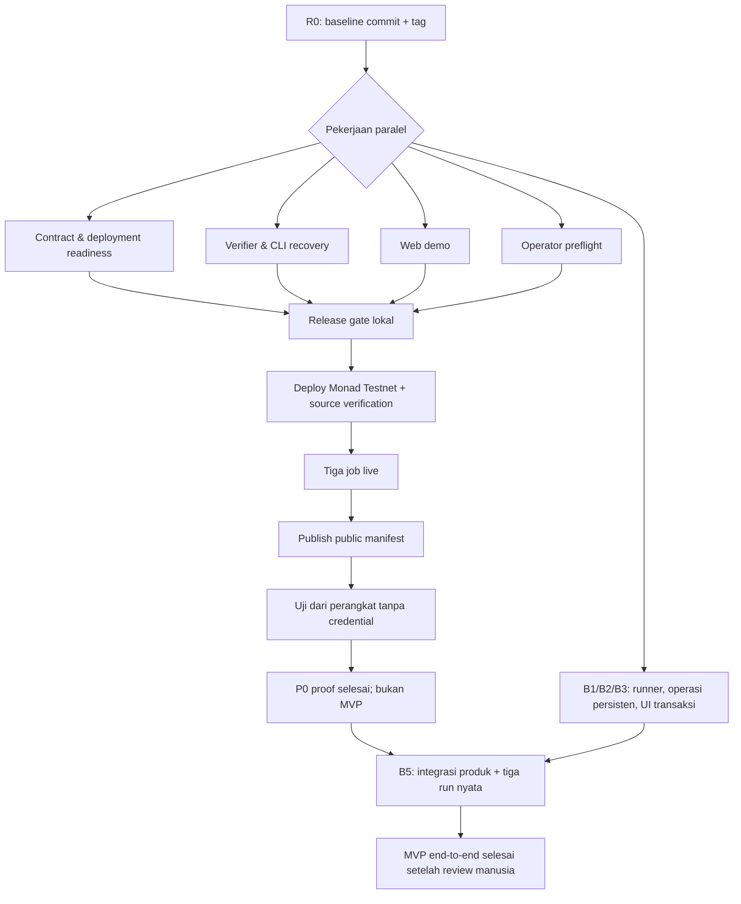

# XYX Monad — alur kerja dan pembagian implementator

Dokumen ini mengubah [PRD Monad](XYX_MONAD_PRD.md) dan [blueprint](XYX_MONAD_BLUEPRINT.md) menjadi pekerjaan P0 dan MVP end-to-end yang dapat diberi kepada beberapa implementator tanpa saling menimpa kode. Demo Monad Testnet yang dapat diperiksa publik adalah gate P0, **bukan titik selesai produk**. Target rilis adalah alur buyer → provider → attestor → settlement/refund yang dapat dijalankan melalui produk dengan transaksi nyata, bukan menghidupkan fitur lama dari Arc.

Kontrak kanonik adalah `XYXDeliveryProtocol`, `XYXPasskeyRegistry`, dan `MonadP256Verifier` di `packages/contracts/src/`. Siklusnya: `proposeJob → acceptJob → fundJob → submitDelivery → resolveJob`, dengan `cancelProposal` sebelum fund dan `claimExpiryRefund` setelah `expiresAt`. Kontrak/CLI/format manifest `AgenticCommerce` / `XYXEvaluator` / `xyx.payout.v1` / `xyx.monad.public-manifest.v1` sudah pensiun dan hanya hidup di namespace legacy `@xyx/monad/legacy`.

## 1. Kondisi awal dan hasil yang dituju

Kode lokal sudah mempunyai `XYXDeliveryProtocol`, `MonadP256Verifier`, registry passkey WebAuthn/P256, verifier settlement dua RPC, manifest kanonik IPFS (`xyx.monad.canonical-manifest.v1`), jalur expiry refund chain-only, dan halaman `/demo`. Semua ini sudah lolos gate lokal yang dicatat di blueprint. Ini **belum** berarti ada deployment atau demo live.

P0 selesai hanya jika tiga job Monad Testnet yang berbeda dapat diverifikasi tanpa kredensial operator:

1. delivery sesuai spec lalu reward dibayar ke provider (`COMPLETE`);
2. delivery tidak sesuai spec lalu reward dikembalikan ke buyer (`REJECT`);
3. job kedaluwarsa lalu reward dikembalikan ke buyer tanpa verdict (`EXPIRED`).

Untuk setiap job, penonton harus bisa membuka manifest kanonik, evidence IPFS, transaksi, receipt, state akhir on-chain, dan transfer USDC escrow. Tidak ada worker, SDK agen, marketplace, subgraph, ERC-8004, atau wallet flow browser yang menjadi syarat demo P0.

MVP end-to-end **belum selesai pada A8**. B1 (runner/SDK), B2 (operasi persisten), B3 (alur transaksi buyer/provider/attestor/refund), dan B5 (integrasi serta tiga run nyata melalui produk) adalah pekerjaan wajib MVP. Implementasinya boleh dimulai setelah ABI/schema stabil dan berjalan paralel dengan persiapan P0 bila owner file terpisah; penerimaan live MVP tetap menunggu bukti deployment dan P0. Marketplace, mainnet, dan model deadline v2 bukan syarat MVP.

## 2. Satu keputusan yang wajib dibuat sebelum paralel

Worktree saat ini berisi rewrite besar dari proyek lama ke Monad, termasuk penghapusan banyak file Arc dan file Monad yang belum dilacak. Karena itu maintainer/release owner perlu satu checkpoint Git yang direview dari kondisi kanonis saat ini. **Status:** tag historis `monad-p0-baseline` menunjuk commit `a43c605` ("chore: initialize XYX Monad P0 baseline"), tetapi tree tag tersebut belum memuat `XYXDeliveryProtocol`, `XYXPasskeyRegistry`, atau `MonadP256Verifier` yang masih berada di worktree. Tag itu bukan checkpoint rewrite kanonis dan bukan bukti gate; hasil lima gate harus dibaca dari run terbaru.

Checkpoint kanonis yang masih diperlukan harus berisi source Monad yang direview, penghapusan source Arc yang memang disengaja, PRD, blueprint, dan lockfile; hasil lima gate harus dicatat bersama review, bukan diasumsikan dari keberadaan tag. Jangan memasukkan `.env`, private key, output `.next`, cache, atau run record yang berisi data sensitif.

Setiap implementator membuat branch dari checkpoint kanonis yang sudah direview manusia, **bukan** dari tag historis yang belum memuat source kanonis. Tanpa checkpoint itu, reviewer tidak dapat membedakan perubahan baru dari rewrite sebelumnya dan konflik merge akan membesar.



## 3. Peran dan hak akses

| Peran | Jumlah | Memegang | Tidak boleh dilakukan |
| --- | ---: | --- | --- |
| Release owner | 1 | baseline, keputusan PRD, merge, release checklist | mengubah invariant atau deployment diam-diam |
| Implementator kontrak | 1 | `packages/contracts/**`, deployment-preflight | broadcast memakai key produksi/testnet orang lain |
| Implementator protocol | 1 | `packages/monad/**`, `scripts/**`, test protocol | mengubah ABI kontrak tanpa koordinasi |
| Implementator web | 1 | `apps/web/**`, tes/build UI | menyimpan key/RPC secret di browser |
| Chain operator | 1, dapat dirangkap release owner | `.env` lokal, keystore, Pinata upload credential, broadcast | memberi secret ke branch, log, manifest, atau chat |
| Implementator MVP SDK/backend | 1, dapat dirangkap owner protocol bila kapasitas cukup | B1/B2 setelah ABI/schema stabil; operasi persisten dan runner | broadcast tanpa otorisasi, menaruh signer buyer di server publik, atau mengklaim run P0 sebagai bukti MVP |

Tiga alamat job yang wajib berbeda adalah buyer, provider, dan attestor. Relayer pembayar gas bersifat opsional; bila digunakan, kuncinya tetap dipisahkan dan ia hanya dapat memanggil fungsi permissionless seperti `claimExpiryRefund`, bukan `resolveJob` untuk attestor lain. Deployer dicatat terpisah pada record deployment. **Tidak ada admin atau pauser** pada kontrak kanonis, sehingga tidak ada alamat role yang perlu disiapkan; pembatasan otoritas attestor hanya lewat pemilihan alamat saat `proposeJob` pada job baru. Chain operator memegang otorisasi dan transaksi live pada gate P0; pada MVP, buyer/provider/attestor mengirim aksi dari wallet masing-masing melalui produk. Implementator hanya menyiapkan kode dan command yang dapat direview, tanpa memakai key atau melakukan broadcast atas nama pengguna.

Jika hanya tersedia tiga implementator, gabungkan **kontrak** dan **release** pada orang yang sama. Jangan gabungkan protocol dan web pada branch yang sama selama P0 karena keduanya akan sering berubah dan sulit direview.

## 4. Pembagian pekerjaan P0

### R0 — Baseline dan release control

**Owner:** release owner. **Dikerjakan lebih dulu.**

| Item | Tindakan | Bukti selesai |
| --- | --- | --- |
| R0.1 | Review diff rewrite Monad, pastikan tidak ada runtime Arc, secret, cache, atau artefak deployment lama yang ikut checkpoint kanonis. | Checkpoint Git kanonis yang dapat di-clone setelah review manusia. **Status: terbuka**; tag historis `monad-p0-baseline` (`a43c605`) ada, tetapi tree-nya belum memuat tiga kontrak kanonis di worktree saat ini. |
| R0.2 | Jalankan `npm run test:contracts`, `npm test`, `npm run typecheck`, `npm run build:web`, dan `git diff --check`. | Output lima command dicatat di PR/CI. **Status:** hasil per-run terbaru ada di blueprint bagian 12; baca angka dari sana, jangan dari dokumen rencana ini. |
| R0.3 | Buat issue board memakai ID dalam dokumen ini dan tetapkan satu owner per ID. | Tidak ada dua owner untuk file yang sama. |
| R0.4 | Review perubahan ABI, schema, atau PRD sebelum merge. | Catatan keputusan singkat bila ada perubahan material. |

**Batas file:** semua file hanya untuk baseline; sesudah baseline, release owner tidak mengedit source workstream lain kecuali saat merge conflict.

### C1 — Hardening kontrak dan tes keamanan

**Owner:** implementator kontrak. **Branch:** `feat/c1-contract-hardening`.

**Scope:** `packages/contracts/src/**`, `packages/contracts/test/**`, dan dokumentasi kontrak yang terkait. Lifecycle P0 kanonis tercakup di `XYXDeliveryProtocol.t.sol` dan `XYXDeliveryProtocolSecurity.t.sol`. `C1Hardening.t.sol` dan `MonadLifecycle.t.sol` menjalankan `AgenticCommerce` dan `XYXEvaluator` yang sudah pensiun; hasilnya bukan bukti kontrak kanonis dan tidak boleh dikutip sebagai tes `XYXDeliveryProtocol`. Pekerjaan ini menutup tes risiko kanonis yang belum dibuktikan, bukan menulis ulang arsitektur.

| Subtask | Hasil yang dibuat | Kriteria penerimaan |
| --- | --- | --- |
| C1.1 | Tambah tes untuk domain EIP-712 `JobVerdict` dengan verifying contract salah, signer tanpa credential passkey (alamat tanpa credential terdaftar di `XYXPasskeyRegistry`), `resolveJob` setelah `expiresAt`, dan nonce/digest replay. | Semua jalur invalid revert dan tidak mengonsumsi nonce/digest bila transaksi revert. Pencabutan credential **belum dapat diuji** karena `XYXPasskeyRegistry` tidak punya fungsi revoke/penghapusan credential — ini tetap tercatat sebagai gap produk (lihat PRD §2 dan §13), bukan kriteria penerimaan. |
| C1.2 | Tambah tes token yang revert/false return dan reentrancy bila mock yang tepat dapat dibuat tanpa memalsukan perilaku USDC. | Dana escrow dan status job tidak korup saat transfer gagal atau callback menyerang. |
| C1.3 | Tambah invariant/property test ringkas untuk total reward job funded versus saldo escrow dan ketidakmungkinan settlement dua kali. | Bukti test meliputi `Completed`, `Rejected`, dan `Expired`. |
| C1.4 | Tinjau event, custom error, constructor arg, dan ABI terhadap PRD. Bila ABI berubah, tulis alasan dan beri tahu semua owner sebelum merge. | Tidak ada perubahan semantik diam-diam; source dan test lulus. |

**Keluar dari scope:** upgrade proxy, banyak token, fee, hooks, dispute manual, dan perubahan lifecycle tanpa keputusan release owner.

### C2 — Preflight dan deployment provenance

**Owner:** implementator kontrak. **Branch setelah C1 merge:** `feat/c2-deployment-provenance`.

**Scope:** `packages/contracts/script/DeployXYXDelivery.s.sol`, `packages/contracts/script/preflight-xyx-delivery.sh`, `verify-xyx-delivery.sh`, `post-deploy-xyx-delivery-bindings.sh`, `record-xyx-delivery-provenance.sh`, contoh record deployment tanpa secret, README/PRD bila command berubah. Script `Deploy.s.sol`, `verify-source.sh`, `post-deploy-bindings.sh`, dan `record-provenance.sh` adalah jalur `AgenticCommerce`/`XYXEvaluator` yang sudah pensiun dan tidak dipakai.

| Subtask | Hasil yang dibuat | Kriteria penerimaan |
| --- | --- | --- |
| C2.1 | Preflight membaca dua RPC dan menolak chain selain Monad Testnet (10143); memeriksa token, `decimals`, bytecode, saldo, konfigurasi constructor, dan artefak lokal sebelum broadcast. Getter pada protocol/registry baru dibaca setelah deployment di C2.3/O2, bukan dianggap tersedia saat preflight. | Dry run gagal aman saat chain/token/config tidak cocok. (Tidak ada admin/pauser/role pada kontrak kanonis, jadi tidak ada role yang dibaca.) |
| C2.2 | Script menghasilkan record deployment versioned berisi commit, compiler/optimizer, bytecode dan ABI hash, constructor args per kontrak (verifier: tanpa argumen; registry: `rpIdHash`, `p256Verifier`; protocol: `paymentToken`, `passkeyRegistry`, `maxVerdictLifetime`), chain ID, token, alamat protocol/registry/verifier, tx hash, block/hash, dan identitas wallet yang dipakai (buyer/provider/attestor terpisah; relayer bila digunakan). | Record tidak memuat key, URL RPC rahasia, JWT, raw signed transaction, atau environment dump. |
| C2.3 | Tulis runbook source verification dan post-deploy binding check: `paymentToken`, `passkeyRegistry`, dan `maxVerdictLifetime` pada protocol; `p256Verifier` dan `rpIdHash` pada registry; code address; dan receipt. | Operator dapat menjalankan command dari checkout baru dengan keystore lokal. |

**Ketergantungan:** C1 harus sudah merged bila ABI/bytecode berubah. **Tidak ada broadcast pada task ini.** Broadcast adalah O2.

### V1 — Recovery CLI dan serialisasi signer

**Owner:** implementator protocol. **Branch:** `feat/v1-operation-recovery`.

**Scope:** `packages/monad/**`, `scripts/claim-refund.ts`, dan `packages/monad/test/**`. `scripts/monad-demo.ts` sudah pensiun (`LEGACY_SCRIPT_RETIRED`) dan bukan lagi bagian dari scope; `scripts/claim-refund.ts` sekarang menjadi jalur kanonik `claimExpiryRefund`.

Tujuannya adalah mengubah kondisi broadcast ambigu menjadi operasi yang dapat direkonsiliasi tanpa mengirim transaksi ganda.

**Klarifikasi refund expiry (wajib dibaca sebelum mengubah `scripts/claim-refund.ts`):**

- `signedCandidateHash` adalah kandidat transaksi yang sudah ditandatangani secara LOKAL. Hash itu **bukan** `refundTx`.
- Hash kandidat itu **bukan** bukti broadcast, mining, finality, refund expiry, maupun transisi state job mana pun.
- `refundTx` hanya ditulis setelah seluruh syarat berikut terpenuhi:
  1. RPC mengembalikan hash broadcast yang cocok dengan hash kandidat lokal;
  2. receipt sukses terlihat dari primary RPC;
  3. finality / required confirmations teramati;
  4. secondary RPC yang independen melihat receipt yang sama dan state job `Expired` setelah refund.
- Kegagalan `send` yang ambigu (bisa jadi masuk, bisa tidak) **tidak** boleh menulis refund record yang selesai. Tidak ada operasi yang boleh mempromosikan kandidat ambigu menjadi refund selesai.
- Rekonsiliasi kandidat yang menggantung tetap menjadi concern operasional di masa depan, tetapi P0 tidak boleh mempromosikannya otomatis.
- Implementasi saat ini sudah punya lock per run; nonce queue per signer dan pemulihan umum masih terbuka.

| Subtask | Hasil yang dibuat | Kriteria penerimaan |
| --- | --- | --- |
| V1.1 | Journal operasi atomik dengan intent, signer, nonce, unsigned/sent tx hash bila ada, waktu, receipt, status retry, dan idempotency key. | Crash sebelum/selama/sesudah send dapat diinspeksi tanpa menebak. |
| V1.2 | Lock/lease signer lokal untuk satu nonce writer dan recovery timeout yang eksplisit. | Dua command dengan signer sama tidak dapat mengirim nonce yang sama; lock basi dapat direcover dengan bukti. |
| V1.3 | Command `inspect` atau command khusus untuk reconcile hash/nonce/receipt dan menjelaskan tindakan aman berikutnya. | Test mencakup timeout RPC, receipt tertunda, hash sudah mined, dan job sudah final. |
| V1.4 | Pertahankan jalur `claim-refund` chain-only: `claimExpiryRefund(jobId)` hanya membaca `getJob` dan head block. | IPFS/attestor unavailable tidak mencegah refund expiry. |

**Batas penting:** jangan membangun database/worker di V1. Journal lokal cukup untuk demo P0; operasi persisten masuk B2 sebagai syarat MVP dan kode B2 boleh dimulai setelah ABI/schema stabil, tidak harus menunggu A8 live.

### V2 — Ketahanan verifier, schema, dan manifest

**Owner:** implementator protocol. **Branch setelah V1 merge:** `feat/v2-verifier-release-tests`.

**Scope:** `packages/monad/src/{canonical,delivery,delivery-chain,canonical-chain,canonical-events,commitments,verdict,settlement,manifest,verification,storage,demo-state,config}.ts`, test terkait, dan publisher manifest kanonik.

Implementasi inti dua RPC, finality, commitment binding, settlement proof, dan manifest sudah ada. Task ini memastikan kegagalan operasional tidak berubah menjadi klaim palsu.

| Subtask | Hasil yang dibuat | Kriteria penerimaan |
| --- | --- | --- |
| V2.1 | Lengkapi test error taxonomy untuk RPC kedua mati, RPC memberi block hash/state/receipt berbeda, gateway IPFS mati, JSON tidak kanonis, dan manifest corrupt. | Semua kasus menjadi `UNVERIFIED` atau `CONFLICT`; tidak menghasilkan `COMPLETE`/`REJECT` yang dapat ditandatangani. |
| V2.2 | Pastikan publisher melakukan recompute commitment, evidence, dan settlement dari data finalized sebelum upload. | Fixture yang memalsukan emitter/log/receipt/URI ditolak. |
| V2.3 | Bekukan schema v1 dan tulis aturan perubahan: policy/deadline/attestor baru harus memakai spec versi baru. `canonicalRunSchema` adalah discriminated union atas `outcome` (`COMPLETE` / `REJECT` / `EXPIRED`); cross-field check hidup di `canonicalManifestSchema`. | Tidak ada field baru yang mengubah arti `xyx.monad.canonical-manifest.v1` diam-diam. |
| V2.4 | Buat fixture anonymized untuk tiga scenario agar web dan operator menguji bentuk data sama. | Fixture tidak berisi tx live palsu yang diberi label live atau credential. |

**Kepemilikan eksklusif:** hanya owner V2 yang mengubah modul verifikasi di atas sampai task merged. Hal ini mencegah konflik di kode verifikasi yang paling sensitif. `packages/monad/src/chain.ts`, `payout.ts`, dan `legacy.ts` adalah modul pensiun yang hanya boleh diakses lewat namespace `@xyx/monad/legacy`; modul kanonik dan kode baru tidak boleh mengimpornya.

### W1 — Halaman demo yang dapat diaudit

**Owner:** implementator web. **Branch:** `feat/w1-public-demo-auditability`.

**Scope:** `apps/web/**` dan dokumentasi UI. Halaman tetap read-only dan memakai public manifest + RPC + gateway IPFS; tidak ada wallet connect sebagai syarat P0.

| Subtask | Hasil yang dibuat | Kriteria penerimaan |
| --- | --- | --- |
| W1.1 | Rapikan tampilan daftar tiga run dan detail tiap run: scenario, job ID, status chain, spec/evidence hash, seluruh transaksi, serta link explorer/IPFS. | Informasi cukup untuk juri memeriksa tanpa terminal operator. |
| W1.2 | Tampilkan state `PENDING`, `UNVERIFIED`, dan `CONFLICT` dengan alasan aman yang berasal dari verifier, termasuk ketika manifest belum dikonfigurasi. | UI tidak menyebut fixture atau data lokal sebagai `LIVE VERIFIED`. |
| W1.3 | Pisahkan klaim manifest dari hasil observasi: kolom `claimedOutcome`, `observedStatus`, dan `verification` terpisah; status final on-chain tidak pernah dirender dari klaim manifest. | Tidak ada status live yang bersumber dari JSON saja. |
| W1.4 | Tampilkan batas ekonomi/trust P0: attestor dipilih buyer dan dipercaya; delivery yang salah tidak dapat dibatalkan; expiry mengembalikan reward saja. | Copy selaras dengan PRD dan tidak menjanjikan trustlessness. |
| W1.5 | Tambah test/build coverage yang berarti untuk config kosong, manifest rusak, dan satu run gagal sementara run lain tetap tampil. | `npm run typecheck` dan `npm run build:web` lulus; tidak ada secret dengan prefiks `NEXT_PUBLIC_`. |

**Tidak dikerjakan di W1:** create/fund dari wallet browser, operator dashboard, login, database, atau agent chat UI. Alur transaksi buyer/provider/attestor/refund adalah B3 yang **wajib untuk MVP**, bukan backlog opsional. Implementasi browser B3 kini memuat jalur wallet, WebAuthn, pemeriksaan dua RPC, dan handoff terenkripsi persisten melalui SQLite satu-worker, tetapi belum dibuktikan lewat deployment/runs live; jurnal operasi chain masih lokal per-browser dan publikasi evidence/manifest belum selesai. Jangan membaca gate lokal sebagai penyelesaian B3 atau menghidupkan label `SIMULATED` untuk transaksi yang benar-benar dikirim wallet.

### O1 — Preflight lingkungan Monad

**Owner:** chain operator. **Dapat paralel dengan C1, V1, dan W1.**

Ini pekerjaan operasional, bukan PR code. Nilai chain/token/RPC dapat berubah; operator harus memverifikasi ulang dengan dokumentasi Monad resmi dan RPC sebelum broadcast.

1. Buat wallet buyer, provider, attestor, dan deployer sesuai PRD; buat wallet relayer terpisah hanya bila relayer dipakai. Gunakan keystore/secret manager lokal, bukan `.env` yang di-commit.
2. Konfigurasi dua endpoint Monad Testnet yang independen semampunya (`XYX_RPC_URL` dan `XYX_SECONDARY_RPC_URL`), Kubo atau Pinata untuk write/readback, dan public IPFS gateway untuk reader.
3. Cek `eth_chainId` (10143), saldo MON pengirim, USDC balance buyer/provider, `decimals()`, bytecode token, serta akses explorer.
4. Isi `XYX_PROTOCOL_ADDRESS`, `XYX_PAYMENT_TOKEN_ADDRESS`, `XYX_REGISTRY_ADDRESS`, dan `XYX_P256_VERIFIER_ADDRESS` dengan alamat non-nol; alamat nol membuat `/demo` dan UI wallet menampilkan state konfigurasi-belum-lengkap.
5. Jalankan preflight C2 dan uji upload/readback JSON IPFS dari perangkat/browser tanpa credential upload.
6. Simpan bukti non-rahasia di record operasi lokal atau artifact yang sudah direview; jangan mempublikasikan key atau endpoint bertoken.

O1 selesai bila setiap preflight punya hasil aktual dan semua kegagalan diblok sebelum transaksi apa pun dikirim.

### O2 — Deploy baru dan verifikasi source

**Owner:** chain operator, dengan release owner sebagai reviewer. **Ketergantungan:** C1, C2, V1, V2, W1, dan lima gate lulus.

1. Jalankan ulang preflight setelah commit release final.
2. Deploy `MonadP256Verifier`, lalu `XYXPasskeyRegistry` yang terikat pada verifier, lalu `XYXDeliveryProtocol` yang terikat pada registry ke Monad Testnet dengan keystore deployer.
3. Catat receipt, block, code hash, constructor args, token, identitas wallet (buyer/provider/attestor serta relayer bila dipakai), dan commit dalam manifest deployment versioned tanpa secret.
4. Verifikasi source pada explorer yang digunakan dan lakukan post-deploy readback dari dua RPC.
5. Review binding protocol ↔ registry ↔ verifier dan `rpIdHash` registry sebelum ada job dibuat.

Jika satu post-deploy check gagal, hentikan sebelum fund. Kontrak tidak upgradeable; perubahan source/artefak berarti deployment baru dan record baru.

### O3 — Tiga run nyata dan publikasi manifest

**Owner:** chain operator. **Ketergantungan:** O2.

| Run | Urutan | Bukti wajib |
| --- | --- | --- |
| Sukses | `proposeJob` → `acceptJob` → `fundJob` → `submitDelivery` sesuai spec → `resolveJob` verdict COMPLETE | Funding, delivery, verdict/settlement receipt; evidence; USDC escrow → provider. |
| Salah | `proposeJob` untuk job baru → `acceptJob` → `fundJob` → `submitDelivery` dengan delivery tidak sesuai spec → `resolveJob` verdict REJECT | Bukti mismatch; settlement USDC escrow → buyer; peringatan bahwa delivery yang salah tidak terbalik. |
| Expiry | `proposeJob` untuk job baru → `acceptJob` → `fundJob` → lewat `expiresAt` chain → `npm run claim:refund <job-id>` | Receipt expiry/refund dan USDC escrow → buyer, tanpa verdict. |

Setelah tiga run, publish manifest `xyx.monad.canonical-manifest.v1` lewat jalur kanonik (`canonicalManifestSchema` + storage helper). Periksa manifest dari browser/perangkat tanpa credential operator dan dengan RPC kedua. Jalankan `npm run build:web` dengan `XYX_CANONICAL_MANIFEST_URI` dan `XYX_CANONICAL_MANIFEST_HASH` yang sama dan buka `/demo`; hanya saat semua run tervalidasi laman boleh menampilkan `LIVE VERIFIED`.

`npm run demo` dan `npm run publish:manifest` tidak lagi menjalankan apa pun: keduanya mencetak `LEGACY_SCRIPT_RETIRED` karena bergantung pada kontrak dan format payout yang sudah pensiun.

## 5. Urutan merge dan pekerjaan yang boleh paralel

| Gelombang | Task paralel | Syarat untuk lanjut |
| --- | --- | --- |
| 0 | R0 | Baseline commit/tag dan lima gate. |
| 1 | C1, V1, W1, O1 | Masing-masing branch hanya menyentuh scope sendiri. |
| 2 | C2 sesudah C1; V2 sesudah V1; W1 dapat selesai kapan saja | Semua PR direview dan merged. |
| 3 | Release owner menjalankan lima gate dari satu commit gabungan | Hasil gate menjadi kandidat deploy. |
| 4 | O2 | Deployment baru, verified source, dan binding protocol ↔ registry ↔ verifier terbukti. Tidak ada role yang dibuktikan karena kontrak kanonis tidak punya role. |
| 5 | O3 dan final check W1 | Tiga run + manifest publik terverifikasi independen. |
| 2–6 (paralel) | B1/B2/B3 | Wajib untuk MVP; kode dapat dimulai setelah ABI/schema stabil dengan owner terpisah, tetapi bukti live MVP menunggu O2/O3 dan review manusia. |
| 7 | B5 | Uji alur terintegrasi dan tiga run Testnet melalui produk; tidak boleh memakai run operator P0 yang tidak melewati jalur produk sebagai pengganti. |
| 8 | B4 | Sesudah MVP bila keputusan produk menyetujui model deadline/recovery v2. |

Jangan menjalankan dua instance command signer yang sama untuk job yang sama. Jangan mengubah ABI kontrak setelah implementator web membuat integrasi tanpa memberi commit SHA dan changelog kepada seluruh owner.

## 6. Gate yang berlaku untuk setiap pull request

Setiap PR harus menyebut task ID, scope, risiko, perubahan schema/ABI bila ada, dan command yang dijalankan. Sebelum merge perubahan kode yang relevan, jalankan:

```bash
npm run test:contracts
npm test
npm run typecheck
npm run build:web
git diff --check
```

`npm run test:contracts` hanya menjalankan suite kanonis `XYXDeliveryProtocol*.t.sol`, jadi outputnya langsung dapat dikutip sebagai bukti lifecycle kanonis. `npm run test:contracts:legacy` menjalankan `C1Hardening`/`MonadLifecycle` (kontrak `AgenticCommerce`/`XYXEvaluator` yang sudah pensiun) dan hasilnya **tidak** boleh dimasukkan ke bukti kontrak kanonis. Angka tes harus dicetak dari run yang sama dengan PR; jangan menyalin angka dari PR lain.

PR tidak boleh:

- menambah key, JWT, endpoint bertoken, raw signed transaction, atau data wallet ke Git;
- menghapus test negatif agar gate hijau;
- mengubah `xyx.monad.canonical-manifest.v1`, `xyx.payout.v1`, atau evidence lama tanpa versi schema baru;
- mengklaim test fixture sebagai chain live;
- mengubah PRD untuk menandai task selesai tanpa bukti source/test/receipt;
- melakukan force push, `git reset`, atau deployment memakai secret milik owner lain.

Template issue/PR yang dipakai semua implementator:

```text
Task ID:
Tujuan:
Owner dan branch:
File yang boleh diubah:
Di luar scope:
Input/ketergantungan:
Perubahan ABI/schema (ya/tidak, jelaskan):
Tes dan command:
Bukti selesai (link PR, output gate, receipt bila live):
Risiko tersisa dan handoff:
```

## 7. Checklist handoff antar owner

### Contract → protocol/web/operator

- commit SHA dan ABI/bytecode hash final untuk `XYXDeliveryProtocol`, `XYXPasskeyRegistry`, dan `MonadP256Verifier`;
- constructor args final serta nama/parameter event dan `JobStatus` enum yang dipakai verifier;
- hasil tes dan daftar perubahan ABI;
- tidak ada alamat deployment yang dianggap final sebelum O2.

### Protocol → web/operator

- schema manifest/spec/evidence final (`xyx.monad.canonical-manifest.v1`) dan fixture anonymized;
- daftar alasan `UNVERIFIED`/`CONFLICT` yang boleh ditampilkan;
- command exact yang masih hidup (`npm run claim:refund` untuk refund expiry, `npm run readiness`, dan `npm run workflow:triage`); `npm run demo` dan `npm run publish:manifest` hanya mencetak `LEGACY_SCRIPT_RETIRED` dan tidak boleh dipakai sebagai bukti;
- bukti bahwa refund expiry tidak bergantung IPFS atau signer attestor;
- pernyataan bahwa API payout/commerce pensiun hanya ada di namespace `@xyx/monad/legacy`.

### Web → operator/release

- variable public yang wajib tersedia untuk surface browser (`NEXT_PUBLIC_XYX_PROTOCOL_ADDRESS`, `NEXT_PUBLIC_XYX_REGISTRY_ADDRESS`, `NEXT_PUBLIC_XYX_P256_VERIFIER_ADDRESS`, `NEXT_PUBLIC_XYX_RP_ID`, `NEXT_PUBLIC_XYX_RPC_URL`, `NEXT_PUBLIC_XYX_CHAIN_ID`). Ini dibaca `packages/monad/src/config.ts` dan hanya untuk kode yang berjalan di browser. Halaman `/demo` berjalan di server dan memakai nama tanpa prefix: `XYX_PROTOCOL_ADDRESS`, `XYX_PAYMENT_TOKEN_ADDRESS`, `XYX_RPC_URL`, `XYX_SECONDARY_RPC_URL`, `XYX_CANONICAL_MANIFEST_URI`, `XYX_CANONICAL_MANIFEST_HASH`. Jangan mencampur kedua daftar;
- screenshot/build result dari state kosong, pending, unverified, conflict, dan verified;
- pernyataan eksplisit bahwa tidak ada secret di bundle.

### Operator → release

- deployment manifest, verified-source URL, dan hasil binding dua RPC;
- tiga evidence URI/hash dan seluruh tx hash/receipt/block;
- hasil pembukaan `/demo` dari lingkungan tanpa key;
- catatan biaya gas aktual dan masalah testnet yang terjadi.

## 8. Workstream wajib MVP end-to-end

B1–B3 bukan blocker **demo P0**, tetapi merupakan blocker **rilis MVP**. Mereka bukan fitur opsional. Kode dapat dikerjakan setelah ABI/schema stabil dengan branch dan owner terpisah; tidak satu pun hasil lokal mengizinkan deployment atau broadcast. B5 menggabungkan mereka setelah bukti chain P0 tersedia. B4 tetap pasca-MVP.

| ID | Owner yang tepat | Yang dibangun | Acceptance minimum |
| --- | --- | --- | --- |
| B1 | implementator SDK/provider | SDK dan runner provider untuk membaca syarat/funding final, mengeksekusi tugas yang diizinkan, mengirim transfer tugas, dan `submitDelivery`; signer disuplai integrator, bukan disimpan di server publik. | Satu job dapat diproses tanpa edit JSON/manifest manual; wrong-chain, spec mismatch, transfer gagal, dan retry ambigu berhenti aman. |
| B2 | implementator backend | Operasi persisten dengan deployment allowlist, job/event/evidence, idempotency key, signer lease, cursor, dan rekonsiliasi receipt/finality; Postgres atau penyimpanan persisten setara yang diputuskan sebelum implementasi. | Restart/backfill/duplicate event/nonce concurrency dan broadcast ambigu diuji; tidak ada state `finalized` dari prepared request atau hash lokal. |
| B3 | implementator web | Wallet-connected buyer create/approve/fund, provider accept/delivery, attestor credential registration/review/assertion/resolve, serta klaim expiry; tampilkan operasi pending/failed/ambiguous/finalized dari observasi. `/demo` tetap read-only. | Tiga aktor dapat menuntaskan alur normal tanpa CLI operator/edit JSON; wallet/chain salah, expiry, allowance, passkey, RPC/IPFS gagal aman; tidak ada key server atau fake receipt di browser. |
| B5 | release owner + owner B1/B2/B3 + chain operator | Integrasi seluruh jalur produk dan validasi tiga skenario COMPLETE/REJECT/EXPIRED di Monad Testnet dengan otorisasi manusia untuk aksi chain. | Receipt, state, event, dan transfer cocok pada dua RPC; manifest/evidence publik bisa diaudit tanpa credential; tiga run **berasal dari jalur produk**, bukan hanya skrip operator P0. |
| B4 (pasca-MVP) | release owner + contract/protocol | Model deadline/recovery v2 (`executeBy`, `submitBy`, `settleBy`, policy/attestor binding). | ADR, schema v2, tes migrasi, dan deployment baru jika kontrak berubah. |

Arsitektur target B2: satu Next.js app, satu Node worker, dan penyimpanan persisten yang disetujui. Jalankan satu worker dahulu; penyimpanan memegang idempotency key dan lease signer. RPC/Pinata credential berada di worker/uploader; browser hanya memakai data publik dan wallet yang dihubungkan pengguna, tanpa server key. Hosting baru dipilih setelah kebutuhan operasi dan backup/restore diuji. Redis, Kubernetes, banyak worker, subgraph, dan queue eksternal belum diperlukan sampai beban nyata membuktikannya.

## 9. Definition of done yang dipakai release owner

P0 hanya ditutup ketika seluruh poin berikut terbukti:

- satu commit release lulus lima command gate;
- deployment Monad Testnet baru memiliki source verification, receipt, block, code hash, token, dan binding yang dicatat (identitas aktor operasional dicatat bila relevan, bukan role kontrak yang memang tidak ada);
- tiga job memenuhi tiga scenario P0 (`COMPLETE`, `REJECT`, `EXPIRED`);
- manifest/evidence IPFS dapat dibaca tanpa credential operator dan cocok byte hash-nya;
- verifier dari dua RPC menyetujui receipt/state final/settlement yang sama;
- `/demo` menunjukkan hasil sebenarnya, memisahkan `claimedOutcome` dari `observedStatus`, dan memberi `UNVERIFIED`/`CONFLICT` bila sumber gagal;
- refund expiry diuji tanpa worker, IPFS, atau attestor;
- scope dan batas trust/ekonomi pada demo sesuai PRD.

Jika salah satu bukti belum ada, statusnya tetap “lokal siap, belum demo live”, bukan selesai.

**MVP end-to-end hanya ditutup setelah P0 dan B1/B2/B3/B5 diterima.** Buyer, provider, dan attestor harus dapat menyelesaikan alur normal melalui produk dengan wallet/passkey mereka sendiri tanpa edit JSON atau CLI operator; expiry refund dapat diklaim tanpa attestor/worker/IPFS. Tiga run Testnet baru atau yang benar-benar dijalankan lewat produk harus menunjukkan COMPLETE, REJECT, dan EXPIRED dengan receipt/state/log yang cocok pada dua RPC, evidence publik, dan UI yang tidak memalsukan pending/finality. Restart, duplicate event, wrong wallet/chain, kegagalan passkey/storage/RPC, serta broadcast ambigu harus gagal aman atau dapat direkonsiliasi. Release owner mereview semua bukti sebelum menyebutnya MVP. Lulus P0 saja hanya boleh disebut “demo P0 terbukti”, bukan “MVP selesai”.
