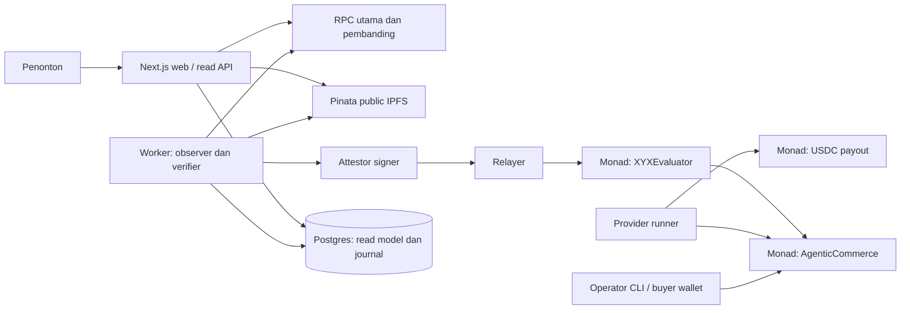

# XYX Monad — audit implementasi dan rancangan pengembangan

Tanggal: 19 September 2026. Pendamping [PRD](XYX_MONAD_PRD.md), disusun dari kode workspace dan sumber resmi. Ini adalah rancangan keputusan dan pekerjaan berikutnya; fitur berlabel **target** belum dianggap dibuat. Semua deployment baru tetap Monad Testnet. Tidak ada migrasi alamat, state, atau layanan Arc.

## 1. Kesimpulan dan keputusan produk

XYX saat ini adalah **pilot escrow dengan pemeriksaan payout dan operator CLI**. Belum ada layanan agen otonom, SDK integrasi, backend persisten, atau tiga transaksi demo publik yang terbukti. Kontrak dan verifier merupakan fondasi; klaim “produk selesai” atau “sudah melindungi semua pekerjaan agen” belum tepat.

Rekomendasi produk: **komponen verifikasi hasil kerja dan settlement untuk developer agen**. Buyer mengikat syarat pekerjaan pada job, provider menyerahkan bukti, verifier menilai syarat yang objektif, dan evaluator mengotorisasi pembayaran. Payout USDC menjadi contoh pertama yang bisa diperiksa oleh siapa pun. SDK dan contoh provider otomatis menjadi cara mengintegrasikannya setelah demo dasar selesai.

Pengguna awal yang dituju adalah developer yang sudah memiliki workflow agen dengan tugas terukur dan ingin menghubungkan bukti pekerjaan dengan pembayaran. Kebutuhan pasar ini masih hipotesis. Validasi melalui contoh integrasi dan wawancara developer diperlukan sebelum memperluas task type atau membangun marketplace.

**Keputusan ruang lingkup:**

| Area | Keputusan yang direkomendasikan | Alasan |
| --- | --- | --- |
| Jaringan | Monad Testnet, satu deployment resmi XYX per rilis | Mengurangi konfigurasi ambigu dan ruang replay |
| Tugas pertama | Transfer USDC langsung dari provider ke recipient | Hasil objektif; contoh kontrak dan verifier mudah diaudit |
| Settlement | Dua kontrak: escrow dan evaluator | Dana/status dimiliki escrow; otoritas keputusan dimiliki evaluator |
| Verifikasi | Deterministik, berdasarkan chain dan spesifikasi | Keputusan uang tidak bergantung pada keluaran bahasa model |
| Bukti | JSON kanonis, hash, IPFS publik, manifest tervalidasi | Penonton dapat membaca kembali bukti tanpa kunci operator |
| Identitas | Alamat wallet dan role kontrak | ERC-8004 tidak dibutuhkan untuk membuktikan demo pertama |
| Agent integration | Contoh provider otomatis dan SDK kecil setelah alur dasar benar | Memisahkan klaim integrasi agen dari CLI yang masih manual |
| Bisnis awal | Layanan/SDK untuk developer; belum menarik fee | P0 membuktikan perilaku dan kebutuhan integrator |

Payout sederhana sebenarnya bisa diselesaikan secara atomik oleh kontrak khusus. Jadi payout saja belum menjadi keunggulan produk yang kuat. Yang perlu dibuktikan XYX adalah pola integrasi reusable: spesifikasi → bukti → keputusan yang dapat diaudit → settlement. Jangan mengklaim generalisasi itu sudah terbukti hanya karena satu jenis transfer berhasil.

## 2. Status nyata per komponen

| Komponen | Bukti di repository | Status dan pekerjaan tersisa |
| --- | --- | --- |
| Escrow | `packages/contracts/src/AgenticCommerce.sol` | Lifecycle, token immutable, auth, refund, block funding/submission, reservasi deliverable sudah ada; deployment dan review independen belum terbukti |
| Evaluator | `packages/contracts/src/XYXEvaluator.sol` | EIP-712, role, pause, nonce/digest replay, settlement atomik sudah ada; tetap mempercayai attestor |
| Deploy | `packages/contracts/script/Deploy.s.sol` | Guard chain 10143 dan input dasar; belum menghasilkan manifest deployment yang tervalidasi |
| Spesifikasi | `packages/monad/src/canonical.ts`, `payout.ts` | Hash kanonis dan schema v1; validasi uint256, alamat nol, dan versi policy perlu diperketat |
| Verifier | `packages/monad/src/payout.ts`, `chain.ts` | Pemeriksaan waktu/block, finality, calldata, log tunggal, binding job, evidence v2, snapshot finalized dan pembandingan dua RPC sudah ada; deployment/live belum terbukti |
| IPFS | `packages/monad/src/storage.ts` | Kubo/Pinata upload dan readback hash; belum ada tes failure lengkap, reader publik tanpa upload credential, dan manifest publik |
| CLI | `scripts/monad-demo.ts` | Prepare/create/budget/fund/execute/evaluate/refund/inspect; lock per run, tulis atomik, hash sebelum broadcast; rekonsiliasi otomatis dan lock per wallet belum ada |
| Web | `apps/web/app/demo/page.tsx` | Membaca manifest publik/IPFS, snapshot finalized, serta receipt settlement; belum ada manifest/live URI, cross-RPC, dan halaman job detail |
| Infrastruktur lokal | `compose.yaml` | Hanya Kubo; belum ada worker, Postgres, backup, atau monitoring aplikasi |
| Agen/SDK | Belum ada modul aktif | CLI tidak membuktikan agen otonom; contoh integrasi perlu dibuat |
| CI/deployment publik | Belum ada pipeline baru yang dibuktikan | Build bersih, version pin, deploy record, dan tiga kasus live masih menjadi gate |

Graphify yang tersedia masih memetakan arsitektur lama. Hasilnya tidak dipakai sebagai sumber fakta implementasi Monad. Perbarui graph setelah struktur baru stabil; angka node terisolasi bukan bukti bug runtime.

## 3. Konflik dan risiko yang perlu ditutup

### 3.1 Replay dan hubungan transfer dengan job

Implementasi terbaru menyimpan `fundedAtBlock`, `submittedAtBlock`, serta `deliverableJob[provider][txHash]`. Verifier memakai aturan konservatif `fundedBlock < transferBlock < submittedBlock`, memeriksa waktu transfer sebelum expiry, dan menolak receipt yang belum finalized atau tidak cocok dengan block kanonis.

Reservasi hash berlaku untuk provider yang sama pada **deployment escrow yang sama**. Provider lain tidak dapat mengunci hash milik korban melalui mapping tersebut; verifier tetap harus menolak sender yang salah. Ini belum merupakan proteksi replay universal antar deployment. Manifest resmi harus menunjuk satu deployment aktif; migrasi berikutnya memerlukan kebijakan replay eksplisit.

Aturan block terpisah sengaja menolak eksekusi/submission pada block yang sama. SDK harus menunggu batas block tersebut dan dokumentasi harus menyebutnya. Jika kelak ingin mendukung satu block, ganti dengan verifikasi transaction index dan log index yang diuji; jangan diam-diam melonggarkan policy.

### 3.2 Bukti UI belum cukup

Status job atau satu event bernama `JobVerdictExecuted` belum membuktikan uang berpindah. UI harus memeriksa alamat pengemit log, job ID, decision, reason/evidence hash, tujuan receipt, token, recipient, jumlah, dan finality. Evidence IPFS yang tidak tersedia harus menghasilkan `UNVERIFIED`.

UI sekarang juga dapat gagal seluruh halaman ketika satu file run rusak. Path `demo-runs` dan pemuatan `.env` tergantung direktori proses; Next dan CLI perlu satu konfigurasi root yang eksplisit. Output artefak Foundry wajib dihasilkan sebelum build web pada checkout bersih.

### 3.3 Operator dan pemulihan

Lock per nama run tidak mencegah dua run memakai nonce wallet yang sama. Target worker harus menserialkan pengiriman per `(chainId, wallet)` dan memakai kunci idempotensi. Transaksi yang timeout tidak boleh langsung diganti dengan transaksi pekerjaan baru.

CLI refund/inspect saat ini masih melewati pembacaan IPFS dan sejumlah prasyarat global. Kontrak refund sendiri tidak membutuhkan IPFS. Buat jalur pemulihan minimal berbasis chain agar storage/verifier yang mati tidak menghalangi operator mengklaim refund.

### 3.4 Keamanan kontrak dan token

SafeERC20 tidak membuktikan token adalah USDC asli. Enam desimal dan adanya bytecode juga tidak cukup. Deployment harus menggunakan alamat USDC yang diverifikasi dan mencatat identitas token serta binding escrow/evaluator. Token dengan fee/rebase tidak didukung P0; menggunakan token lain memerlukan desain accounting berbeda.

Pemisahan wallet di CLI bukan invariant kontrak. Escrow umum menerima evaluator yang dipilih pembuat job; aplikasi XYX hanya boleh menandai job terverifikasi jika evaluator dan commerce cocok dengan deployment yang disetujui. Jangan menampilkan job arbitrary sebagai job terlindungi oleh XYX.

ERC-8183 masih draft. Sebut implementasi ini escrow yang mengikuti lifecycle ERC-8183 dengan batas P0, dan sediakan matriks kesesuaian sebelum klaim kompatibilitas penuh. Menambahkan pembatasan payout pada kontrak generik juga harus tercatat sebagai pilihan produk. [Spesifikasi ERC-8183](https://eips.ethereum.org/EIPS/eip-8183).

Ada ketidaksesuaian PRD lama: `complete` menolak sesudah expiry, tetapi `reject` saat ini tidak memeriksa expiry. Verdict REJECT dan refund expiry bisa bersaing menghasilkan label `Rejected` atau `Expired`, walaupun keduanya mengembalikan dana yang sama. Rekomendasi sebelum deployment baru: setelah expiry, alur aplikasi memakai `claimRefund`; bila ingin invariant on-chain bahwa semua verdict setelah expiry gagal, tambahkan guard kontrak dan tes kedua jalur sebagai perubahan eksplisit. Jangan mengklaim invariant itu sudah ada.

## 4. Ekonomi, trust, dan aturan waktu

Uang pada demo harus dijelaskan terpisah:

| Peristiwa | Buyer | Provider | Recipient |
| --- | --- | --- | --- |
| Fund | Mengunci 0,02 USDC | Belum menerima reward | Belum menerima payout |
| Transfer valid | Reward masih di escrow | Mengirim 0,01 USDC miliknya | Menerima 0,01 USDC |
| COMPLETE | Reward dibayarkan | Menerima 0,02 USDC; net token +0,01 sebelum gas | Tetap memegang payout |
| REJECT | Reward 0,02 USDC kembali | Payout yang terlanjur dikirim tidak kembali otomatis | Transfer salah tetap terjadi kepada alamat tujuan transaksi |
| Expiry tanpa eksekusi | Reward kembali | Tidak menerima reward | Tidak ada payout |
| Eksekusi valid tetapi attestor gagal sampai expiry | Reward dapat kembali | Bisa kehilangan payout dan gas | Tetap menerima payout |

Poin terakhir adalah batas ekonomi utama. Escrow menjamin aturan perpindahan reward; attestor menjamin penilaian hasil hanya selama ia jujur dan tersedia. Produk belum menjamin provider tidak rugi atau membalikkan transfer yang salah.

**Kebijakan P0 yang direkomendasikan:** demo memakai nominal testnet, evaluator dikelola operator, satu `expiredAt` tetap menjadi deadline kontrak. Provider otomatis hanya memulai ketika health verifier baik dan waktu tersisa memenuhi margin. Gunakan margin awal 180 detik sebagai parameter operasi yang harus diuji, bukan jaminan penyelesaian. Simpan aturan versi ini secara publik; jangan mengubah syarat penilaian untuk job yang sudah dibuat.

**Sebelum nilai nyata/P1:** tambahkan model `executeBy < submitBy < settleBy`, komit policy/version dan evaluator pada spec versi baru, serta proses ketika attestor gagal. Grace period memperkecil risiko keterlambatan tetapi tidak menghapusnya. Opsi lebih kuat meliputi recovery attestor dengan otoritas jelas atau task tertentu yang dapat disettle atomik. Pilihan ini memerlukan perubahan trust, tes, dan deployment baru; tidak boleh dipasarkan sebagai perlindungan yang sudah ada.

Klaim aman untuk P0: “Reward disettle oleh attestor berdasarkan bukti on-chain yang bisa diperiksa.” Hindari klaim “trustless”, “semua pekerjaan AI terverifikasi”, “dana provider dijamin”, atau “refund membatalkan payout”.

## 5. Alur pengguna dan demonstrasi

### Alur P0

1. Operator memastikan deployment, role, RPC, IPFS, dan saldo siap.
2. Buyer menentukan recipient, amount, provider, reward, expiry. UI/CLI menampilkan persis nilai yang akan dikomit.
3. Spesifikasi diunggah dan dibaca ulang; buyer membuat job lalu mendanai escrow.
4. Provider membaca syarat dan funding finalized, memeriksa margin waktu, melakukan transfer, lalu submit hash.
5. Verifier membaca state dan receipt pada snapshot yang konsisten, memeriksa policy, menyimpan evidence, membaca ulang, lalu meminta signature attestor.
6. Relayer mengirim verdict; observer memeriksa settlement finalized dan log USDC.
7. Penonton membuka halaman job dan mengunduh manifest/evidence untuk verifikasi mandiri.

Untuk expiry, langkah 4–6 tidak dijalankan. Sesudah deadline chain, caller mana pun memanggil refund. Halaman membuktikan log refund tanpa menuntut verdict yang memang tidak ada.

### Rancangan halaman

| Halaman | Isi dan aksi yang dibutuhkan | Tahap |
| --- | --- | --- |
| `/demo` | Penjelasan singkat, tiga run, status verifikasi terpisah dari status kontrak | P0 |
| `/jobs/[chainId]/[commerce]/[jobId]` | Syarat, timeline, expected/observed, evidence, settlement, trust assumptions | P0 |
| `/proofs/.../manifest.json` | Manifest tanpa rahasia yang dapat diunduh | P0 |
| `/new` | Form terms, preview komitmen, wallet create/fund | P1 setelah P0 |
| Operator console | Health, job tertunda, retry aman, reconciliation, expiry | CLI P0; UI internal P1 |

Badge verifikasi harus punya definisi: `PENDING` bila aksi/finality belum selesai; `UNVERIFIED` bila sumber belum tersedia; `CONFLICT` bila sumber bertentangan; `LIVE VERIFIED` hanya jika seluruh bukti kasus tersebut cocok. `Expired` adalah status kontrak, bukan label kualitas verifikasi.

### Naskah demo 3–4 menit

- 0:00–0:30: masalah klaim agen dan syarat yang dapat diuji; tampilkan buyer/provider/attestor berbeda.
- 0:30–1:30: job sukses, dari komitmen hingga reward ke provider; buka satu receipt dan evidence.
- 1:30–2:30: job berbeda dengan recipient salah; tampilkan field mismatch dan reward kembali ke buyer. Jelaskan payout yang salah tidak dibatalkan.
- 2:30–3:15: job expiry yang sudah disiapkan sebelumnya; tampilkan deadline chain dan klaim refund. Nyatakan job memang disiapkan sebelum presentasi.
- 3:15–4:00: tunjukkan manifest publik dan cara developer memanggil contoh integrasi.

Siapkan tiga run nyata sebelum presentasi; tampilkan satu aksi baru secara live bila layanan sehat. Bila RPC gagal, tampilkan rekaman yang diberi label rekaman beserta bukti transaksi, dan pertahankan status halaman sebagai unverified sampai pemeriksaan pulih.

## 6. Arsitektur target dan sumber kebenaran

Database adalah indeks/catatan operasi, bukan pemilik status settlement. Chain memiliki job dan perpindahan uang. IPFS memiliki byte bukti yang diikat hash. Manifest menghubungkan identitas deployment, job, dan bukti. Cache tidak boleh mengalahkan hasil RPC yang bertentangan.

Keputusan job hanya berubah dari receipt/state yang diverifikasi. Log diproses dengan urutan `(blockNumber, transactionIndex, logIndex)` dan key unik. Event evaluator mengisi data verdict; event commerce/state escrow menentukan status lifecycle. Dua handler tidak boleh menulis status final secara independen. Ini menyelesaikan kelas konflik lama tanpa membawa subgraph lama.

## 7. Infrastruktur yang dipakai

### Pilihan minimum dan target pilot

| Kebutuhan | Demo P0 | Pilot publik setelah bukti P0 lulus |
| --- | --- | --- |
| Smart contract | Solidity 0.8.30 + Foundry Monad + OpenZeppelin, dependency dikunci | Stack sama, audit sebelum nilai nyata |
| Web | Next.js yang sudah ada, satu service Railway | Service sama, read API dan cache job |
| Eksekusi | CLI lokal pada mesin operator | Satu worker Node.js/TypeScript Railway yang selalu hidup |
| Penyimpanan run | JSON journal lokal + manifest publik di IPFS | PostgreSQL untuk jobs, receipts, retries, leases |
| Bukti | Pinata public upload + gateway baca | Sama, recheck pin/availability dan backup manifest |
| RPC | Alchemy Monad Testnet utama; endpoint resmi Monad untuk pembanding/fallback | Dua endpoint terpisah; provider kedua diganti dedicated bila batas publik mengganggu |
| Monitoring | Log JSON, cek health sebelum demo, receipt pada explorer | Worker heartbeat, queue lag, saldo gas, RPC/IPFS error, expiry margin |
| Kunci | Keystore deployer, env lokal wallet testnet | Secret per service/role; signer terpisah sebelum menerima dana nyata |
| CI | Build kontrak → tes → typecheck → build web | Ditambah migrasi DB, integration test, release gate |

Pilihan Railway menyatukan hosting web, worker, dan Postgres ketika diperlukan. Memindahkan CLI langsung ke request web akan membuat long-running action dan recovery lebih sulit; worker persisten memisahkan operasi chain dari permintaan halaman. Pinata dipilih karena evidence harus dapat dibaca publik meski laptop operator mati. Kubo tetap berguna untuk pengembangan lokal.

Ketersediaan layanan diverifikasi dari [panduan Next.js/worker Railway](https://docs.railway.com/guides/fullstack-nextjs), [jaringan yang didukung Alchemy](https://www.alchemy.com/docs/reference/node-supported-chains), serta [upload file Pinata](https://docs.pinata.cloud/files/uploading-files). Gateway publik harus bisa membaca CID XYX tanpa JWT penulis dan tidak dijadikan proxy arbitrary CID. [Dokumentasi gateway Pinata](https://docs.pinata.cloud/gateways/dedicated-ipfs-gateways).

Railway Postgres merupakan template layanan **unmanaged**. Maintenance, backup, kontrol akses, dan restore tetap menjadi tanggung jawab operator. Gunakan jaringan privat antar service, backup volume terjadwal, export portabel, dan satu uji restore sebelum pilot publik. Jika tim tidak bersedia mengoperasikannya, evaluasi Postgres yang dikelola penuh sebelum B2. [Railway PostgreSQL](https://docs.railway.com/databases/postgresql), [backup/restore](https://docs.railway.com/guides/postgres-backups-restores).

Biaya belum dikutip sebagai harga layanan. Catat penggunaan compute, database/storage, RPC, IPFS/gateway, dan domain; pilih plan setelah mengecek tarif dan kuota akun. Harga/grant/sponsor tidak diasumsikan gratis. Jangan memasang Kubernetes, Kafka, Redis, vector database, node Monad sendiri, atau indexer terpisah sebelum ada kebutuhan terukur.

### Fakta jaringan dan preflight

- Chain ID 10143, MON untuk gas, dan RPC testnet harus dibaca dari konfigurasi resmi serta diperiksa dengan `eth_chainId`.
- Alamat USDC testnet saat audit: `0x534b2f3A21130d7a60830c2Df862319e593943A3`; lakukan verifikasi token sebelum deploy.
- Foundry memakai `network = "monad"`; build/test lokal tidak memerlukan default RPC aktif, deployment memakai RPC eksplisit.
- Monad membebankan gas limit. Estimasi, simulasi, dan cap per operasi diperlukan; jangan memakai limit besar sebagai jalan keluar transaksi yang revert.

Rujukan: [Foundry pada Monad](https://docs.monad.xyz/guides/deploy-smart-contract/foundry), [USDC testnet dalam panduan Monad](https://docs.monad.xyz/guides/x402), [gas pricing](https://docs.monad.xyz/developer-essentials/gas-pricing).

Rujukan jaringan yang ringkas dan diperbarui untuk agent: [Current Facts for AI Agents](https://docs.monad.xyz/ai/current-facts). Jangan menyalin chain ID mainnet 143 ke konfigurasi testnet 10143.

### Finality dan pembandingan RPC

Receipt berdasarkan hash bisa tersedia sebelum finalized. Penerimaan broadcast juga belum membuktikan transaksi masuk block. Observer harus memeriksa receipt terhadap finalized head dan hash block kanonis. Nilai `null` saat transaksi masih pending tidak otomatis berarti dropped. [Semantik JSON-RPC Monad](https://docs.monad.xyz/reference/json-rpc/overview).

Untuk keputusan uang, baca pada block yang kedua RPC akui finalized, cocokkan block hash, job/deliverable, receipt, dan log penting. Jika tidak cocok atau secondary tidak tersedia, jangan sign; retry dalam batas deadline. Fallback transport meningkatkan ketersediaan tetapi tidak sama dengan verifikasi melalui dua sumber. Hindari mencampur respons block berbeda menjadi satu evidence.

## 8. Kontrak, policy, dan evidence

### Escrow

Pertahankan status `Open/Funded/Submitted/Completed/Rejected/Expired`, token immutable, expected budget saat funding, reservasi deliverable per provider, dan refund permissionless. Catat block funding/submission. P0 menerima provider sejak create; tidak memerlukan hooks, fee, atau proxy. Tambahkan tes untuk seluruh transisi terlarang dan kegagalan token, bukan hanya jalur sukses.

### Evaluator

Pertahankan signature EIP-712 yang mengikat chain dan alamat evaluator, role attestor, nonce/digest, max lifetime, serta pause. Satu resolve harus mengotorisasi paling banyak satu settlement. Revert escrow harus membatalkan konsumsi nonce/digest. Attestor dapat dicabut, tetapi keberhasilan keputusan lama dinilai dari receipt historis, bukan role signer saat halaman dibuka.

### Policy payout

Target policy dipublikasikan dengan versi dan test vectors: chain/token/deployment benar; spec/job cocok; sender provider; calldata `transfer(recipient, amount)` persis; receipt finalized; tepat satu log Transfer token yang memenuhi syarat; block transfer di antara funding/submission; belum dipakai provider pada job lain; transfer sebelum deadline. Token dengan transfer fee/rebase dan batch/multicall berada di luar policy pertama.

Kegagalan mendapatkan data berhenti sebagai `UNVERIFIED`. Bukti lengkap bahwa transaksi salah menghasilkan `REJECT`. State/spec/binding yang tidak konsisten harus diperiksa sebagai konflik konfigurasi sebelum menyalahkan provider.

### Bentuk data

Spec v1 yang sudah dibuat tidak diubah maknanya. Evidence baru memakai `xyx.payout.evidence.v2` karena menambahkan binding dan block. Untuk policy waktu/evaluator baru, buat spec v2 dengan `policyId`, `policyVersion`, `evaluator`, serta deadline yang eksplisit, dan tulis migration note. Tidak boleh menafsirkan bukti lama memakai aturan baru secara diam-diam.

Manifest publik target berisi `schemaVersion`, `chainId`, `commerce`, `evaluator`, `token`, `jobId`, `specURI/specHash`, `evidenceURI/evidenceHash` bila ada, hash create/fund/transfer/submit/verdict/refund yang tersedia, block numbers/hashes, policy version, dan waktu pengecekan. Jangan memasukkan private key, RPC secret, JWT Pinata, atau raw signed transaction yang belum disiarkan.

Verifier membaca byte IPFS, memeriksa hash, memvalidasi schema, lalu membandingkan isi evidence dengan hasil recompute. Hash saja membuktikan integritas byte, bukan kebenaran bukti. Identitas file run atau timestamp lokal tidak boleh menjadi bukti hasil chain.

## 9. Aturan verifikasi settlement

Untuk setiap kasus final, cek receipt sukses, tujuan transaksi yang benar, block finalized/kanonis, event dari kontrak yang benar, job ID, state akhir, dan Transfer USDC yang tepat:

| Kasus | Event lifecycle | Penerima reward | Bukti tambahan |
| --- | --- | --- | --- |
| COMPLETE | JobCompleted + PaymentReleased dari escrow | Provider, sebesar budget | Verdict decision 1, evidence/reason hash sesuai, hasil recompute COMPLETE |
| REJECT setelah funding | JobRejected + Refunded dari escrow | Buyer, sebesar budget | Verdict decision 2 dan hasil recompute REJECT |
| EXPIRED | JobExpired + Refunded dari escrow | Buyer, sebesar budget | Timestamp block refund ≥ expiredAt; tidak mensyaratkan verdict |

Transfer harus berasal dari escrow dan dipancarkan token yang disetujui. Funding juga dibuktikan melalui receipt, JobFunded, serta Transfer buyer → escrow. Jika job ditolak ketika Open, tidak ada uang yang harus di-refund; UI tidak boleh mengklaim refund pada kasus itu.

## 10. Worker, API, dan database target

Bagian ini untuk pilot publik; belum ada di repository. Demo P0 tidak harus menunggu semua API berikut selesai.

Worker memakai loop observer dari deployment block → finalized head, menyimpan cursor, memvalidasi job, menjadwalkan verification, menyimpan evidence, lalu mengeksekusi signature/relay sesuai role. Gunakan retry terbatas dengan backoff dan jitter. RPC/IPFS error tidak diubah menjadi verdict negatif.

| Tabel | Identitas/constraint utama | Kegunaan |
| --- | --- | --- |
| `deployments` | chain + commerce; evaluator/token/code hash/deployment block | Allowlist deployment dan provenance |
| `jobs` | chain + commerce + job ID | Proyeksi status, terms, last checked block/hash |
| `events` | chain + block hash + tx hash + log index | Dedup, ordering, dan audit perubahan |
| `evidence` | evidence hash; unique job + policy version + input hash | URI, schema, decision, verification outcome |
| `operations` | unique idempotency key | Intent, wallet, nonce, signed tx hash, attempts, receipt, failure |
| `leases` | chain + signer, serta task/job | Serialisasi pengiriman dan pengambilalihan worker setelah crash |
| `cursors` | deployment + observer version | Recovery polling tanpa melewatkan event |

Simpan uint256 sebagai decimal string/numeric yang memadai, bukan JavaScript Number. Pisahkan `chainStatus` dari `verificationStatus`, `lastObservedAt`, dan `finalizedAt`. Jika receipt belum ada, operation tetap pending/unresolved. Gunakan transaksi DB dan constraint unik untuk idempotensi; satu worker dahulu, tambah jumlah hanya setelah concurrency test lulus.

API publik target: `GET /api/config`, `GET /api/jobs`, `GET /api/jobs/:chain/:commerce/:id`, `GET .../manifest`, dan `GET /health` dengan detail aman. API operator target: `POST .../evaluate`, `POST .../reconcile`, dan `POST .../refund`; wajib auth operator, input schema, rate limit, dan idempotency key. Public API tidak menerima private key atau calldata arbitrary untuk ditandatangani.

Provider runner hanya boleh memanggil aksi dari spec yang telah tervalidasi pada deployment allowlist. SDK target menyediakan create/fund/submit/read/verify helper; signer disuplai integrator. Model bahasa, bila ditambahkan nanti, mengusulkan tugas melalui tool schema; policy uang tetap deterministik dan membutuhkan otorisasi spending yang eksplisit.

## 11. Wallet, secrets, dan operasi

Deployer menggunakan keystore lokal. Buyer/provider memakai wallet testnet berbeda. Attestor hanya menandatangani verdict; relayer mengirim transaksi dan membutuhkan MON. Admin/pauser dicatat terpisah dari wallet demo. Memisahkan alamat tetapi menyimpan semua kunci dalam proses yang sama belum menjadi isolasi keamanan.

Web publik tidak memiliki kunci transaksi. Worker awal hanya memiliki kunci yang diperlukan untuk tugasnya; private key buyer tidak masuk worker publik. Pinata upload credential hanya di uploader, reader publik menggunakan gateway tanpa akses upload. RPC key dan DB URL tetap server-side. Jangan menggunakan prefiks `NEXT_PUBLIC_` untuk secret.

Deployment harus mempunyai manifest versioned berisi commit, compiler, optimizer, ABI/bytecode hash, constructor arguments, chain, token, alamat, receipt/hash/block deployment, role, dan tautan verified source. Artefak yang berubah mengharuskan deployment baru karena kontrak tidak upgradeable. Menyimpan alamat dalam `.env` saja tidak cukup.

Health yang diperlukan: koneksi RPC dan chain benar; finalized head maju; backlog verification; IPFS write/readback; saldo MON/USDC operasional; lease/nonce yang macet; waktu tersisa menuju expiry. Web tetap dapat memberi status unverified saat worker mati. Refund mempunyai jalur CLI chain-only yang tidak bergantung pada storage.

Healthcheck deployment Railway bukan monitor uptime berkelanjutan, dan metrik CPU/memori tidak menggantikan metrik job/settlement. Tambahkan heartbeat aplikasi serta cek uptime setelah hosting siap. [Healthchecks](https://docs.railway.com/deployments/healthchecks), [metrics](https://docs.railway.com/observability/metrics).

Backup: manifest/evidence di IPFS publik, salinan deployment dalam repo tanpa secret, dump DB berkala di penyimpanan terpisah, dan uji restore. Log memakai run/job/operation ID; redact secrets dan signed payload. Jangan mengaktifkan pengiriman notifikasi eksternal tanpa konfigurasi serta otorisasi pengguna.

## 12. Backlog dengan hasil yang harus terlihat

| ID | Pekerjaan dan lokasi target | Ketergantungan | Kriteria selesai |
| --- | --- | --- | --- |
| A0 | Integrasi binding/finality verifier, UI caller, tes baru | Perubahan hardening saat audit | Typecheck, verifier tests, kontrak tests, build web lulus |
| A1 | Bekukan payout policy dan dokumentasi batas ekonomi | A0 | Satu versi syarat, tidak ada klaim refund membalikkan payout atau jaminan provider |
| A2 | Snapshot state finalized + dua RPC di `packages/monad` | A1 | **Lokal selesai:** RPC mismatch/unavailable menghasilkan UNVERIFIED; snapshot state dan receipt dibandingkan pada block finalized |
| A3 | Settlement verifier dan evidence recompute | A1 | **Lokal selesai:** semua kasus sukses/salah/expiry memerlukan log USDC yang benar; log palsu ditolak |
| A4 | Schema run/manifest, reader IPFS publik, error isolation UI | A3 | **Lokal selesai:** schema ketat, publisher memverifikasi bukti sebelum upload, dan web tak membaca journal; perlu uji gateway/manifes live |
| A5 | Config root, clean build, deployment manifest dan preflight | A0 | Checkout bersih bisa build; chain/token/alamat berbeda ditolak sebelum broadcast |
| A6 | Rekonsiliasi CLI + lock signer + refund tanpa IPFS | A5 | Refund chain-only dengan hash/journal sebelum broadcast sudah ada; nonce lock per signer dan recovery timeout umum masih perlu |
| A7 | Deploy baru dan source verification | A1–A6 + tests keamanan | Receipt, code, roles, binding dan block tersimpan; source bisa dibuka |
| A8 | Tiga run testnet + manifest public + demo page | A7 | Penonton tanpa key dapat membuktikan payout/reject/refund dari receipt, IPFS dan UI |
| B1 | Provider runner + contoh SDK integrasi | A8 | Program contoh memakai spec/job dan menuntaskan tugas tanpa mengandalkan edit JSON manual |
| B2 | Worker persisten + Postgres + operation journal | A8 | Restart, backfill, duplicate event, dan nonce concurrency lolos integration test |
| B3 | UI create/fund dengan wallet dan operator auth | B1–B2 | Browser tidak menerima server keys; wrong chain/wallet/input gagal aman |
| B4 | Model deadline/recovery yang lebih kuat | Evaluasi risiko setelah A8 | Spec versi baru, keputusan trust eksplisit, tes deadline dan migrasi; deploy ulang jika kontrak berubah |

Urutan kritis: tutup correctness → buktikan dana/bukti → deploy → tiga demo → integrasi/otomasi. Jangan mengerjakan marketplace, reputasi, banyak task type, atau agent UI percakapan sebelum A8.

Estimasi perencanaan untuk satu developer yang fokus: A0–A2 sekitar 1–2 hari kerja; A3–A6 sekitar 2–4 hari; A7–A8 sekitar 1–2 hari dengan RPC/faucet/storage tersedia; B1–B3 sekitar 3–6 hari. Ini kisaran kapasitas, bukan deadline yang dijamin; kegagalan testnet atau temuan kontrak dapat menambah waktu. B4 memerlukan keputusan desain dan tidak dimasukkan ke estimasi demo.

## 13. Tes, kriteria rilis, dan ukuran sukses

Tes kontrak tambahan: signature salah domain kontrak, nonce sama pada verdict berbeda, revoked role, timestamp boundary, pause/expiry, refund ganda, evaluator unauthorized, token revert/false return/reentrancy, serta invariants dana escrow dibanding job aktif. Mapping nonce yang bertambah adalah biaya state dan tidak otomatis membuat lookup semakin mahal sebanding jumlah entry; jangan menerapkan pruning yang menghidupkan replay.

Tes verifier: sender/token/recipient/amount/input salah, log palsu, dua Transfer, receipt revert, spec/binding salah, transfer lama, same-block boundaries, deadline, finalized mismatch, inconsistent block hash, RPC timeout, dan readback IPFS gagal. Storage perlu tes ukuran berlebih, CID invalid, JSON nonkanonis, hash salah, serta gateway unavailable.

Tes operasi: crash setelah signing/sebelum receipt, dua job pada signer sama, restart worker, duplicate event, cursor recovery, IPFS mati saat refund, dan fresh clone build. Tes UI memeriksa state pending/unverified/conflict, satu run rusak, dan seluruh prasyarat label LIVE VERIFIED.

Gate rilis P0: source dan dependency version tercatat; semua checks lulus; kontrak baru terverifikasi; tiga job berbeda dan transfer berbeda; evidence dapat diakses dari perangkat lain; settlement log cocok; refund dapat dipanggil tanpa worker; batas trust terlihat di halaman. Tes lokal saja tidak memenuhi gate live.

Ukuran sukses awal: tiga dari tiga kasus terbukti; nol false verified dalam tes negatif; restart tidak menggandakan transaksi; satu developer lain dapat menjalankan verifier dari manifest publik tanpa private key. Ukur latensi dari submission finalized → verdict finalized dan tampilkan hasil aktual; jangan menjanjikan kecepatan end-to-end dari block time Monad saja.

## 14. Menjaga PRD dan implementasi tetap sinkron

PRD menyimpan invariant produk dan acceptance. Dokumen ini menyimpan alasan keputusan, status komponen, infra, dan backlog. Catat perubahan penting dalam ADR singkat dengan konteks, keputusan, dampak, dan tes. Schema/policy berubah berarti versi baru, bukan overwrite dokumen lama lalu menganggap semua job mengikuti arti baru.

Setiap milestone diperbarui dari bukti: file kode dan hasil tes untuk lokal; receipt/code/IPFS untuk live. Jangan menyebut fitur selesai karena schema atau contoh command sudah ditulis. Dokumen historis dan graph lama tidak dapat mengalahkan deployment/code saat ini.

## 15. Metropolis: track, sponsor, dan riwayat proyek

Pilihan track utama yang direkomendasikan: **Trust, Identity & AI Infrastructure**. Kecocokan ini adalah penilaian produk karena XYX memeriksa bukti pekerjaan sebelum settlement. Track tersebut tidak berarti XYX harus menambahkan registri identitas atau model bahasa. Consumer Products & Payments baru lebih sesuai bila produk dipusatkan pada pengalaman pembayaran pengguna akhir.

Halaman resmi menyatakan existing project dapat ikut bila pekerjaan yang diajukan baru, dibuat dalam build window 1 September–13 Oktober, dan bisa diperiksa juri. Catat baseline ETHOnline dan perubahan Monad melalui history/commit serta write-up; jangan mengklaim seluruh repo dibuat dari nol selama acara. Ketentuan penuh, tahun/periode yang berlaku di akun peserta, dan eligibility submission tetap perlu dicocokkan pada portal acara. [Metropolis resmi](https://monad.xyz/developers/hackathons/metropolis).

| Sponsor/integrasi | Pilihan XYX | Bukti integrasi yang perlu ditunjukkan |
| --- | --- | --- |
| Alchemy — Best Projects using Alchemy | Prioritas pertama karena RPC memang dibutuhkan | Pembacaan chain/finality, konfigurasi tanpa membocorkan key, demo dan penjelasan penggunaan |
| Envio — Best Use of Envio | Opsional setelah core lulus | Indexer/timeline event yang benar-benar berjalan; hindari dua sistem indexing yang redundant |
| Privy atau Dynamic | Pilih satu bila onboarding wallet P1 dibangun | Pengguna benar-benar bisa onboarding/create/fund melalui integrasi tersebut |
| Chainlink CRE | Tunda untuk P0 | Perlu desain workflow dan trust attestation yang berbeda serta implementasi nyata |
| MetaMask Agent Wallet Plugin | Tunda kecuali membuat plugin sesuai brief | CLI viem saat ini belum membuktikan integrasi plugin tersebut |

Nama kategori sponsor di atas berasal dari landing resmi. Detail bounty dan integrasi minimum belum seluruhnya dapat diverifikasi di portal yang membutuhkan login; ini rekomendasi kecocokan, bukan pernyataan sudah memenuhi syarat hadiah. Infrastruktur Pinata/Railway juga tidak otomatis berarti sponsor acara.

Sumber resources tambahan yang diminta pengguna adalah [Blitz](https://blitz.devnads.com/resources) dan [Notion resources](https://monad-foundation.notion.site/Resources-3486367594f281baab46d498de3a9515). Gunakan untuk discovery dan benefit peserta; keputusan chain, alamat, API, dan eligibility tetap mengikuti dokumentasi vendor serta aturan acara yang terverifikasi.

## 16. Hasil pengecekan lokal pada audit ini

- `npm run test:contracts`: **17 tes lulus**; termasuk reservasi hash lintas job/provider, pencatatan block, pause/refund expiry, nonce reuse, dan verdict invalid.
- Tes TypeScript: **28 tes lulus** di empat file; mencakup binding/finality, replay, transfer lama, receipt/log/settlement salah, manifest ketat, dan disagreement dua RPC. `npm test` juga lulus; reporter command tersebut merangkum per file.
- `npm run typecheck`: lulus setelah caller UI dan fixture test diintegrasikan dengan `PayoutBinding`.
- `npm run build:web`: lulus. Next saat ini melewati typecheck internal, sehingga command typecheck terpisah tetap wajib sebagai gate CI.
- `git diff --check`: lulus. Pemeriksaan source aktif tidak menemukan chain Arc atau conflict marker yang dicari.

Ini menutup **A0 secara lokal**, bukan A1–A8. Tes masih belum meliputi seluruh acceptance PRD; tidak ada deployment, transaksi live, akun hosting, atau IPFS publik baru yang dilakukan oleh audit ini. Temuan UI settlement, public manifest, recovery refund, snapshot dua RPC, dan batas ekonomi tetap merupakan pekerjaan berikutnya.
