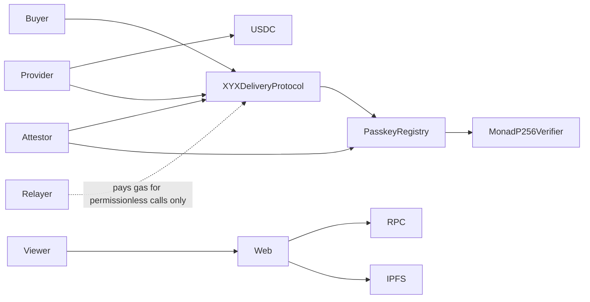

# XYX Monad — audit implementasi dan rancangan pengembangan

Tanggal: 21 September 2026. Pendamping [PRD](XYX_MONAD_PRD.md), disusun dari kode workspace dan sumber resmi. Ini adalah rancangan keputusan dan pekerjaan berikutnya; fitur berlabel **target** belum dianggap dibuat. Semua deployment baru tetap Monad Testnet. Tidak ada migrasi alamat, state, atau layanan Arc.

**Perubahan besar:** alur kanonis sekarang menggunakan `MonadP256Verifier` + `XYXPasskeyRegistry` + `XYXDeliveryProtocol`. Kontrak lama `AgenticCommerce` dan `XYXEvaluator` diganti; evaluator role dan IPFS payout manifest lama tidak digunakan.

## 1. Kesimpulan dan keputusan produk

XYX saat ini adalah **fondasi lokal pilot escrow dengan pemeriksaan payout dan WebAuthn/P256 attestation**, belum MVP end-to-end. Belum ada layanan agen otonom, runner terintegrasi, backend persisten, alur transaksi lengkap dari wallet pengguna, atau tiga transaksi demo publik yang terbukti. Kontrak dan verifier merupakan fondasi; klaim "produk selesai" atau "sudah melindungi semua pekerjaan agen" belum tepat.

Target produk: **MVP end-to-end untuk verifikasi hasil kerja dan settlement bagi developer agen**. Buyer mengikat syarat pekerjaan pada job, provider menjalankan tugas dan menyerahkan bukti, attestor menilai syarat yang objektif dan menandatangani verdict dengan passkey P256, dan protokol mengotorisasi pembayaran. Payout USDC menjadi contoh pertama yang bisa diperiksa oleh siapa pun. Demo P0 membuktikan chain dan audit publik; runner/SDK, operasi persisten, dan antarmuka transaksi nyata adalah pekerjaan wajib sebelum MVP dapat dinyatakan selesai, bukan fitur tambahan opsional.

Pengguna awal yang dituju adalah developer yang sudah memiliki workflow agen dengan tugas terukur dan ingin menghubungkan bukti pekerjaan dengan pembayaran. Kebutuhan pasar ini masih hipotesis. Validasi melalui contoh integrasi dan wawancara developer diperlukan sebelum memperluas task type atau membangun marketplace.

**Keputusan ruang lingkup:**

| Area | Keputusan yang direkomendasikan | Alasan |
| --- | --- | --- |
| Jaringan | Monad Testnet, satu deployment resmi XYX per rilis | Mengurangi konfigurasi ambigu dan ruang replay |
| Tugas pertama | Transfer USDC langsung dari provider ke recipient | Hasil objektif; contoh kontrak dan verifier mudah diaudit |
| Settlement | Satu kontrak: `XYXDeliveryProtocol` | Dana/status dimiliki satu escrow; verifikasi on-chain |
| Attestasi | Passkey WebAuthn/P256 + `MonadP256Verifier` | Eliminasi evaluator role; attestor memegang kunci pribadi |
| Verifikasi | Deterministik, berdasarkan chain dan spesifikasi | Keputusan uang tidak bergantung pada keluaran bahasa model |
| Bukti | JSON kanonis, hash, IPFS publik, manifest tervalidasi | Penonton dapat membaca kembali bukti tanpa kunci operator |
| Identitas | Alamat wallet dan passkey attestor | ERC-8004 tidak dibutuhkan untuk membuktikan demo pertama |
| Agent integration | Runner provider dan SDK kecil wajib untuk MVP, setelah ABI/schema kanonis stabil | Memisahkan klaim integrasi agen dari CLI manual; satu job harus dapat berjalan melalui produk |
| Bisnis awal | Layanan/SDK untuk developer; belum menarik fee | P0 membuktikan perilaku dan kebutuhan integrator |

Payout sederhana sebenarnya bisa diselesaikan secara atomik oleh kontrak khusus. Jadi payout alone belum menjadi keunggulan produk yang kuat. Yang perlu dibuktikan XYX adalah pola integrasi reusable: spesifikasi → bukti → keputusan yang dapat diaudit → settlement. Jangan mengklaim generalisasi itu sudah terbukti hanya karena satu jenis transfer berhasil.

## 2. Status nyata per komponen

| Komponen | Bukti di repository | Status dan pekerjaan tersisa |
| --- | --- | --- |
| Kontrak kanonis | `packages/contracts/src/MonadP256Verifier.sol`, `XYXPasskeyRegistry.sol`, `XYXDeliveryProtocol.sol` | Lifecycle, P256 verify, passkey registry, escrow atomic, EIP-712, nonce/digest replay, expiry refund **sudah ada di source**; **pause/admin/role management tidak ada**; deployment dan review independen belum terbukti. State job hanya menyimpan buyer, provider, attestor, `termsCommitment`, `deliveryCommitment`, budget, `expiresAt`, dan status — tidak ada block anchor maupun hash deliverable yang direservasi |
| Deploy | `packages/contracts/script/DeployXYXDelivery.s.sol` | Guard chain 10143 dan input dasar; belum menghasilkan manifest deployment yang tervalidasi |
| Spesifikasi | `packages/monad/src/delivery.ts`, `commitments.ts` | Schema ketat, canonical hash, zero-address guard, discriminated union manifest sudah ada; verifikasi publik dan IPFS publisher masih perlu |
| Verifier | `packages/monad/src/settlement.ts`, `canonical-chain.ts` | Dual-RPC snapshot finalized, event decoding, settlement verification, error categorization sudah ada; deployment/live belum terbukti |
| IPFS | `packages/monad/src/storage.ts` | Kubo/Pinata upload dan readback hash; belum ada tes failure lengkap, reader publik tanpa upload credential, dan manifest publik |
| Web | `apps/web/app/demo/page.tsx` | Membaca manifest publik/IPFS, snapshot finalized, settlement verification; belum ada manifest/live URI, cross-RPC LIVE_VERIFIED dari receipt nyata |
| Infrastruktur lokal | `compose.yaml` | Hanya Kubo; belum ada worker, Postgres, backup, atau monitoring aplikasi |
| Agen/SDK | Belum ada modul aktif | CLI tidak membuktikan agen otonom; contoh integrasi perlu dibuat |
| CI/deployment publik | Belum ada pipeline baru yang dibuktikan | Build bersih, version pin, deploy record, dan tiga kasus live masih menjadi gate |

## 3. Konflik dan risiko yang perlu ditutup

### 3.1 Replay dan hubungan transfer dengan job

**Status kontrak kanonis:** `XYXDeliveryProtocol` **tidak** menyimpan `fundedAtBlock`, `submittedAtBlock`, maupun `deliverableJob[provider][txHash]`, dan tidak memberlakukan aturan urutan `fundedBlock < transferBlock < submittedBlock`. Field dan aturan itu hanya ada pada `AgenticCommerce`, kontrak escrow yang sudah pensiun, dan modul pembacanya (`packages/monad/src/chain.ts`, namespace `legacy`). Jangan menyebutnya sebagai perilaku `XYXDeliveryProtocol`.

Konsekuensi untuk verifier off-chain:

- Urutan transfer tidak dapat diverifikasi lewat field block pada struct job. Verifier dapat membandingkan receipt/event funding, transfer, dan submission yang sudah final dari RPC independen, tetapi kontrak tidak memberlakukan urutan tersebut; pemeriksaan kanonis atas bukti-bukti itu masih harus dibuktikan sebelum diklaim sebagai proteksi replay.
- Tidak ada reservasi hash deliverable on-chain, sehingga satu txHash transfer tidak terikat satu kali pakai oleh kontrak. Deteksi replay transfer tetap kewajiban verifier off-chain dan **belum terbukti** pada alur kanonis; statusnya gap, bukan fitur.
- Foundry test `C1Hardening.t.sol` dan `MonadLifecycle.t.sol` memang menguji aturan block anchor dan reservasi tersebut, tetapi keduanya menjalankan kontrak pensiun. Hasilnya tidak boleh dikutip sebagai bukti bahwa `XYXDeliveryProtocol` melakukan hal yang sama.

Keputusan yang masih terbuka: apakah memindahkan aturan urutan transfer ke jalur kanonis (kontrak baru) atau membiarkannya sebagai prasyarat verifier off-chain. Ini keputusan produk/desain dan belum diambil; dokumentasi tidak boleh menyimpangkan salah satunya sudah terimplementasi.

### 3.2 Bukti UI belum cukup

Status job atau satu event bernama `JobResolved` belum membuktikan uang berpindah. UI harus memeriksa alamat pengemit log, job ID, decision, reason/evidence hash, tujuan receipt, token, recipient, jumlah, dan finality. Evidence IPFS yang tidak tersedia harus menghasilkan `UNVERIFIED`.

### 3.3 Operator dan pemulihan

Lock per nama run tidak mencegah dua run memakai nonce wallet yang sama. Target worker harus menserialkan pengiriman per `(chainId, wallet)` dan memakai kunci idempotensi. Transaksi yang timeout tidak boleh langsung diganti dengan transaksi pekerjaan baru.

CLI refund/inspect saat ini masih melewati pembacaan IPFS dan sejumlah prasyarat global. Kontrak refund sendiri tidak membutuhkan IPFS. Buat jalur pemulihan minimal berbasis chain agar storage/verifier yang mati tidak menghalangi operator mengklaim refund.

### 3.4 Keamanan kontrak dan token

SafeERC20 tidak membuktikan token adalah USDC asli. Enam desimal dan adanya bytecode juga tidak cukup. Deployment harus menggunakan alamat USDC yang diverifikasi dan mencatat identitas token serta binding escrow. Token dengan fee/rebase tidak didukung P0; menggunakan token lain memerlukan desain accounting berbeda.

Pemisahan wallet di CLI bukan invariant kontrak. `proposeJob` hanya menjamin buyer, provider, dan attestor berbeda; escrow menerima attestor mana pun yang dipilih pembuat job. Aplikasi XYX hanya boleh menandai job terverifikasi jika attestor cocok dengan deployment yang disetujui. Jangan menampilkan job arbitrary sebagai job terlindungi oleh XYX.

ERC-8183 masih draft. Sebut implementasi ini escrow dengan lifecycle bergaya ERC-8183 dengan batas P0, dan sediakan matriks kesesuaian sebelum klaim kompatibilitas penuh. Menambahkan pembatasan payout pada kontrak generik juga harus tercatat sebagai pilihan produk. [Spesifikasi ERC-8183](https://eips.ethereum.org/EIPS/eip-8183).

**Ketidaksesuaian lama yang sudah ditutup pada kontrak kanonis:** `resolveJob` menolak **seluruh** decision (`COMPLETE` maupun `REJECT`) ketika `block.timestamp >= job.expiresAt`, sehingga tidak ada persaingan antara verdict REJECT dan refund expiry setelah expiry. Job yang kedaluwarsa hanya dapat diselesaikan lewat `claimExpiryRefund`. Perilaku berbeda (`complete` menolak sesudah expiry sementara `reject` tidak memeriksa expiry) hanya ada pada `AgenticCommerce` yang sudah pensiun; jangan mengklaim invariant tersebut pada kontrak lama.

## 4. Ekonomi, trust, dan aturan waktu

Uang pada demo harus dijelaskan terpisah:

| Peristiwa | Buyer | Provider | Recipient |
| --- | --- | --- | --- |
| Fund | Mengunci 0,02 USDC | Belum menerima reward | Belum menerima payout |
| Transfer valid | Reward masih di escrow | Mengirim 0,01 USDC miliknya | Menerima 0,01 USDC |
| COMPLETE | Reward dibayarkan | Menerima 0,02 USDC; net token +0,01 sebelum gas | Tetap memegang payout |
| REJECT | Reward 0,02 USDC kembali | Payout yang terlanjur dikirim tidak kembali otomatis | Transfer salah tetap terjadi kepada alamat tujuan transaksi |
| Expired tanpa eksekusi | Reward kembali | Tidak menerima reward | Tidak ada payout |
| Eksekusi valid tetapi attestor gagal sampai expiry | Reward dapat kembali | Bisa kehilangan payout dan gas | Tetap menerima payout |

Poin terakhir adalah batas ekonomi utama. Escrow menjamin aturan perpindahan reward; attestor menjamin penilaian hasil hanya selama ia jujur dan tersedia. Produk belum menjamin provider tidak rugi atau membalikkan transfer yang salah.

**Kebijakan P0 yang direkomendasikan:** demo memakai nominal testnet, attestor dikelola operator, satu `expiredAt` tetap menjadi deadline kontrak. Provider otomatis hanya memulai ketika health verifier baik dan waktu tersisa memenuhi margin. Gunakan margin awal 180 detik sebagai parameter operasi yang harus diuji, bukan jaminan penyelesaian. Simpan aturan versi ini secara publik; jangan mengubah syarat penilaian untuk job yang sudah dibuat.

**Sebelum nilai nyata/P1:** tambahkan model `executeBy < submitBy < settleBy`, komit policy/version dan attestor pada spec versi baru, serta proses ketika attestor gagal. Grace period memperkecil risiko keterlambatan tetapi tidak menghapusnya. Opsi lebih kuat meliputi recovery attestor dengan otoritas jelas atau task tertentu yang dapat disettle atomik. Pilihan ini memerlukan perubahan trust, tes, dan deployment baru; tidak boleh dipasarkan sebagai perlindungan yang sudah ada.

Klaim aman untuk P0: "Reward disettle oleh attestor berdasarkan bukti on-chain yang bisa diperiksa." Hindari klaim "trustless", "semua pekerjaan AI terverifikasi", "dana provider dijamin", atau "refund membatalkan payout".

## 5. Alur pengguna dan demonstrasi

### Alur P0

1. Operator memastikan deployment, RPC, IPFS, dan saldo siap. Tidak ada role on-chain yang perlu dikonfigurasi.
2. Buyer menentukan recipient, amount, provider, reward, expiry. UI/CLI menampilkan persis nilai yang akan dikomit.
3. Spesifikasi di-hash; buyer memanggil `proposeJob(provider, attestor, termsCommitment, budget, expiresAt)` sehingga status `Proposed`.
4. Provider memanggil `acceptJob(jobId)`; status `Accepted`.
5. Buyer memanggil `fundJob(jobId)`; escrow menarik budget dan status `Funded`. Provider baru mulai bekerja setelah receipt funding finalized dan batas waktu yang wajar.
6. Provider melakukan transfer USDC ke recipient, lalu memanggil `submitDelivery(jobId, deliveryCommitment)` sebelum expiry; status `Submitted`.
7. Attestor membaca delivery, mengecek evidence off-chain, lalu memanggil `resolveJob(verdict, assertion)` dari alamatnya sendiri dengan passkey WebAuthn/P256.
8. Observer memeriksa settlement finalized dan log USDC. Jika relayer dipakai, ia hanya membayar gas dan tidak dapat memanggil `resolveJob` kecuali ia memang attestor job itu.
9. Penonton membuka halaman job dan mengunduh manifest/evidence untuk verifikasi mandiri.

Buyer juga dapat memanggil `cancelProposal(jobId)` selama status masih `Proposed`; job berakhir `Cancelled` tanpa memindahkan dana.

Untuk expiry, langkah 6–7 tidak dijalankan. Sesudah deadline chain, caller mana pun memanggil `claimExpiryRefund(jobId)`. Halaman membuktikan log refund tanpa menuntut verdict yang memang tidak ada.

### Rancangan halaman

| Halaman | Isi dan aksi yang dibutuhkan | Tahap |
| --- | --- | --- |
| `/demo` | Penjelasan singkat, run kanonis, status verifikasi terpisah dari status kontrak | P0 |
| `/reference` | Alur buyer/provider/attestor, pembacaan job state, refund expiry | P0 |
| `/jobs/[chainId]/[protocol]/[jobId]` | Syarat, timeline, expected/observed, evidence, settlement, trust assumptions | P1 setelah P0 |
| `/new` | Form terms, preview komitmen, wallet create/fund | P1 setelah P0 |
| Operator console | Health, job tertunda, retry aman, reconciliation, expiry | CLI P0; UI internal P1 |

Badge verifikasi harus punya definisi: `PENDING` bila aksi/finality belum selesai; `UNVERIFIED` bila sumber belum tersedia; `CONFLICT` bila sumber bertentangan; `LIVE VERIFIED` hanya jika seluruh bukti kasus tersebut cocok. `Expired` adalah status kontrak, bukan label kualitas verifikasi.

### Naskah demo 3–4 menit

- 0:00–0:30: masalah klaim agen dan syarat yang dapat diuji; tampilkan buyer/provider/attestor berbeda.
- 0:30–1:30: job sukses, dari komitmen hingga reward ke provider; buka satu receipt dan evidence.
- 1:30–2:30: job berbeda dengan recipient salah; tampilkan field mismatch dan reward kembali ke buyer. Jelaskan payout yang salah tidak dibatalkan.
- 2:30–3:15: job expiry yang sudah disiapkan sebelumnya; tampilkan deadline chain dan klaim refund. Nyatakan job memang disiapkan sebelum presentasi.
- 3:15–4:00: tunjukkan manifest publik dan cara developer memanggil contoh integrasi.

Siapkan tiga run nyata sebelum presentasi; tampilkan satu aksi baru secara live bila layanan sehat. Bila RPC gagal, tampilkan rekaman yang diberi label rekaman beserta bukti transaksi, dan pertahankan status halaman sebagai unverified sampai pemeriksaan pulih.

## 6. Arsitektur target dan sumber kebenaran

Yang tidak boleh ada di diagram ini: `Attestor --> Relayer --> XYXDeliveryProtocol` sebagai jalur verdict. Kontrak menolak `resolveJob` dari `msg.sender != job.attestor`, sehingga relayer independen tidak punya jalur otoritas ke settlement.

Database adalah indeks/catatan operasi, bukan pemilik status settlement. Chain memiliki job dan perpindahan uang. IPFS memiliki byte bukti yang diikat hash. Manifest menghubungkan identitas deployment, job, dan bukti. Cache tidak boleh mengalahkan hasil RPC yang bertentangan.

Keputusan job hanya berubah dari receipt/state yang diverifikasi. Log diproses dengan urutan `(blockNumber, transactionIndex, logIndex)` dan key unik. Event `JobResolved` mengisi data verdict; event `JobFunded`, `JobAccepted`, `DeliverySubmitted`, dan `JobExpired` menentukan status lifecycle. Dua handler tidak boleh menulis status final secara independen.

## 7. Infrastruktur yang dipakai

### Pilihan minimum dan target pilot

| Kebutuhan | Demo P0 | Pilot publik setelah bukti P0 lulus |
| --- | --- | --- |
| Smart contract | Solidity 0.8.30 + Foundry Monad + OpenZeppelin, dependency dikunci | Stack sama, audit sebelum nilai nyata |
| Web | Next.js yang sudah ada, satu service Railway | Service sama, read API dan cache job |
| Eksekusi | CLI lokal pada mesin operator | Satu worker Node.js/TypeScript Railway yang selalu hidup |
| Penyimpanan run | JSON journal lokal + manifest publik di IPFS | PostgreSQL untuk jobs, receipts, retries, leases |
| Bukti | Pinata public upload + gateway baca | Sama, recheck pin/availability dan backup manifest |
| RPC | Dua endpoint Monad Testnet yang independen | Dua endpoint terpisah; provider kedua diganti dedicated bila batas publik mengganggu |
| Monitoring | Log JSON, cek health sebelum demo, receipt pada explorer | Worker heartbeat, queue lag, saldo gas, RPC/IPFS error, expiry margin |
| Kunci | Keystore deployer, env lokal wallet testnet | Secret per service/role; signer terpisah sebelum menerima dana nyata |
| CI | Build kontrak → tes → typecheck → build web | Ditambah migrasi DB, integration test, release gate |

Pilihan Railway menyatukan hosting web, worker, dan Postgres ketika diperlukan. Memindahkan CLI langsung ke request web akan membuat long-running action dan recovery lebih sulit; worker persisten memisahkan operasi chain dari permintaan halaman. Pinata dipilih karena evidence harus dapat dibaca publik meski laptop operator mati. Kubo tetap berguna untuk pengembangan lokal.

Ketersediaan layanan diverifikasi dari [panduan Next.js/worker Railway](https://docs.railway.com/guides/fullstack-nextjs), [jaringan yang didukung Alchemy](https://www.alchemy.com/docs/reference/node-supported-chains), serta [upload file Pinata](https://docs.pinata.cloud/files/uploading-files). Gateway publik harus bisa membaca CID XYX tanpa JWT penulis dan tidak dijadikan proxy arbitrary CID. [Dokumentasi gateway Pinata](https://docs.pinata.cloud/gateways/dedicated-ipfs-gateways).

Railway Postgres merupakan template layanan **unmanaged**. Maintenance, backup, kontrol akses, dan restore tetap menjadi tanggung jawab operator. Gunakan jaringan privat antar service, backup volume terjadwal, export portabel, dan satu uji restore sebelum pilot publik. Jika tim tidak bersedia mengoperasikannya, evaluasi Postgres yang dikelola penuh sebelum B2. [Railway PostgreSQL](https://docs.railway.com/databases/postgresql), [backup/restore](https://docs.railway.com/guides/postgres-backups-restores).

Biaya belum dikutip sebagai harga layanan. Catat penggunaan compute, database/storage, RPC, IPFS/gateway, dan domain; pilih plan setelah mengecek tarif dan kuota akun. Harga/grant/sponsor tidak diasumsikan gratis. Jangan memasang Kubernetes, Kafka, Redis, vector database, node Monad sendiri, atau indexer terpisah sebelum ada kebutuhan terukur.

### Fakta jaringan dan preflight

- Chain ID 10143, MON untuk gas, dan RPC testnet harus dibaca dari konfigurasi resmi serta diperiksa dengan `eth_chainId`.
- Alamat USDC testnet saat audit: `0x534b2f3A21130d7a60830c2Df862319e593943A3`; lakukan verifikasi token sebelum deploy.
- Foundry memakai `network = "monad"`; build/test lokal tidak memerlukan default RPC aktif, deployment memakai RPC eksplisit.
- Monad membebankan gas limit. Estimasi, simulasi, dan cap per operasi diperlukan; jangan memakai limit besar sebagai jalan keluar transaksi yang revert.

Rujukan: [Foundry pada Monad](https://docs.monad.xyz/guides/deploy-smart-contract/foundry), [USDC testnet dalam panduan Monad](https://docs.monad.xyz/guides/x402), [gas pricing](https://docs.monad.xyz/developer-essentials/gas-pricing).

Rujukan jaringan yang ringkas dan diperbarui untuk agent: [Current Facts for AI Agents](https://docs.monad.xyz/ai/current-facts). Jangan menyalin chain ID mainnet 143 ke konfigurasi testnet 10143.

### Finality dan pembandingan RPC

Receipt berdasarkan hash bisa tersedia sebelum finalized. Penerimaan broadcast juga belum membuktikan transaksi masuk block. Observer harus memeriksa receipt terhadap finalized head dan hash block kanonis. Nilai `null` saat transaksi masih pending tidak otomatis berarti dropped. [Semantik JSON-RPC Monad](https://docs.monad.xyz/reference/json-rpc/overview).

Untuk keputusan uang, baca pada block yang kedua RPC akui finalized, cocokkan block hash, job/deliverable, receipt, dan log penting. Jika tidak cocok atau secondary tidak tersedia, jangan sign; retry dalam batas deadline. Fallback transport meningkatkan ketersediaan tetapi tidak sama dengan verifikasi melalui dua sumber. Hindari mencampur respons block berbeda menjadi satu evidence.

## 8. Kontrak, policy, dan evidence

### Escrow

Status kontrak kanonis: `Proposed/Accepted/Funded/Submitted/Completed/Rejected/Expired/Cancelled`. Token immutable pada constructor, budget ditetapkan sekali di `proposeJob` (tidak ada `setBudget`), dan refund expiry permissionless lewat `claimExpiryRefund`. Escrow **tidak** menyimpan block funding/submission dan **tidak** punya reservasi deliverable per provider; "expected budget saat funding" juga tidak ada karena `fundJob(jobId)` membaca `job.budget` dari state. P0 tidak memerlukan hooks, fee, atau proxy. Tambahkan tes untuk seluruh transisi terlarang dan kegagalan token, bukan hanya jalur sukses.

### Passkey registry

Registry menyimpan public key P256 (qx/qy), rp ID hash, dan counter per credential; credential mentah tidak pernah disimpan. `XYXDeliveryProtocol` memanggil `consumeAssertion` untuk memverifikasi assertion attestor sebelum escrow dilepas. Attestor hanya dapat resolve job yang setara dengan `job.attestor`. Registry **tidak** menggunakan PRF output — assertion diverifikasi langsung lewat precompile P256 Monad (`P256.verifyNative`), bukan melalui PRF-derived secret.

### Verifikasi settlement

Untuk setiap kasus final, cek receipt sukses, tujuan transaksi yang benar, block finalized/kanonis, event dari kontrak yang benar, job ID, state akhir, dan Transfer USDC yang tepat:

| Kasus | Event lifecycle | Penerima reward | Bukti tambahan |
| --- | --- | --- | --- |
| COMPLETE | `JobResolved` + `PaymentReleased` dari escrow | Provider, sebesar budget | Verdict decision 1, verdict commitment cocok dengan job, hasil recompute COMPLETE |
| REJECT setelah funding | `JobResolved` + `PaymentReleased` dari escrow | Buyer, sebesar budget | Verdict decision 2 dan hasil recompute REJECT |
| EXPIRED | `JobExpired` + `PaymentReleased` dari escrow | Buyer, sebesar budget | Timestamp block refund >= `expiresAt`; tidak mensyaratkan verdict |

Transfer harus berasal dari escrow dan dipancarkan token yang disepakati. Funding juga dibuktikan melalui receipt, `JobFunded`, serta `Transfer` buyer → escrow. Job yang dibatalkan lewat `cancelProposal` saat masih `Proposed` tidak memindahkan dana; UI tidak boleh mengklaim refund pada kasus itu. Kontrak kanonis tidak memiliki event `Refunded`; event itu milik `AgenticCommerce` yang sudah pensiun.

## 9. Worker, API, dan database target

Bagian ini adalah target MVP end-to-end dan belum ada di repository. Demo P0 tidak harus menunggu seluruh API/worker, tetapi rilis MVP harus membuktikan operasi persisten, rekonsiliasi, dan integrasi aktor sebelum disebut selesai.

Worker memakai loop observer dari deployment block → finalized head, menyimpan cursor, memvalidasi job, menjadwalkan verification, dan menyimpan evidence. Ia tidak mengambil alih wallet buyer/provider atau memanggil `resolveJob` sebagai attestor lain; aksi attestor tetap membutuhkan alamat `job.attestor` dan assertion passkey nyata. Gunakan retry terbatas dengan backoff dan jitter. RPC/IPFS error tidak diubah menjadi verdict negatif.

| Tabel | Identitas/constraint utama | Kegunaan |
| --- | --- | --- |
| `deployments` | chain + protocol; registry/verifier/token/code hash/deployment block | Allowlist deployment dan provenance |
| `jobs` | chain + protocol + job ID | Proyeksi status, terms, last checked block/hash |
| `events` | chain + block hash + tx hash + log index | Dedup, ordering, dan audit perubahan |
| `evidence` | evidence hash; unique job + policy version + input hash | URI, schema, decision, verification outcome |
| `operations` | unique idempotency key | Intent, wallet, nonce, signed tx hash, attempts, receipt, failure |
| `leases` | chain + signer, serta task/job | Serialisasi pengiriman dan pengambilalihan worker setelah crash |
| `cursors` | deployment + observer version | Recovery polling tanpa melewatkan event |

Simpan uint256 sebagai decimal string/numeric yang memadai, bukan JavaScript Number. Pisahkan `chainStatus` dari `verificationStatus`, `lastObservedAt`, dan `finalizedAt`. Jika receipt belum ada, operation tetap pending/unresolved. Gunakan transaksi DB dan constraint unik untuk idempotensi; satu worker dahulu, tambah jumlah hanya setelah concurrency test lulus.

API publik target: `GET /api/config`, `GET /api/jobs`, `GET /api/jobs/:chain/:protocol/:id`, `GET .../manifest`, dan `GET /health` dengan detail aman. API operator target: `POST .../evaluate`, `POST .../reconcile`, dan `POST .../refund`; wajib auth operator, input schema, rate limit, dan idempotency key. Public API tidak menerima private key atau calldata arbitrary untuk ditandatangani.

Provider runner hanya boleh memanggil aksi dari spec yang telah tervalidasi pada deployment allowlist. SDK target menyediakan create/fund/submit/read/verify helper; signer disuplai integrator. Model bahasa, bila ditambahkan nanti, mengusulkan tugas melalui tool schema; policy uang tetap deterministik dan membutuhkan otorisasi spending yang eksplisit.

## 10. Wallet, secrets, dan operasi

Deployer menggunakan keystore lokal. Buyer/provider memakai wallet testnet berbeda. Attestor memegang passkey dan satu-satunya pihak yang alamatnya dapat memanggil `resolveJob`; relayer, bila dipakai, hanya pembayar gas untuk pemanggilan permissionless seperti `claimExpiryRefund` dan membutuhkan MON. Tidak ada alamat admin atau pauser pada deployment kanonis — `DeployXYXDelivery.s.sol` hanya menerima token, registry, dan `VERDICT_LIFETIME`. Memisahkan alamat tetapi menyimpan semua kunci dalam proses yang sama belum menjadi isolasi keamanan.

Aplikasi web dan server publik tidak menerima atau menyimpan private key transaksi pengguna; wallet yang dihubungkan pengguna menandatangani aksinya sendiri. Worker hanya dapat memakai signer yang secara eksplisit disuplai integrator untuk tugas yang diizinkan; private key buyer dan attestor tidak masuk worker publik. Pinata upload credential hanya di uploader, reader publik menggunakan gateway tanpa akses upload. RPC key dan DB URL tetap server-side. Jangan menggunakan prefiks `NEXT_PUBLIC_` untuk secret.

Deployment harus mempunyai manifest versioned berisi commit, compiler, optimizer, ABI/bytecode hash, constructor arguments per kontrak, chain, protocol, token, alamat, receipt/hash/block deployment, identitas aktor operasional yang digunakan (bukan role kontrak), dan tautan verified source. Artefak yang berubah mengharuskan deployment baru karena kontrak tidak upgradeable. Menyimpan alamat dalam `.env` saja tidak cukup.

Health yang diperlukan: koneksi RPC dan chain benar; finalized head maju; backlog verification; IPFS write/readback; saldo MON/USDC operasional; lease/nonce yang macet; waktu tersisa menuju expiry. Web tetap dapat memberi status unverified saat worker mati. Refund mempunyai jalur CLI chain-only yang tidak bergantung pada storage.

Healthcheck deployment Railway bukan monitor uptime berkelanjutan, dan metrik CPU/memori tidak menggantikan metrik job/settlement. Tambahkan heartbeat aplikasi serta cek uptime setelah hosting siap. [Healthchecks](https://docs.railway.com/deployments/healthchecks), [metrics](https://docs.railway.com/observability/metrics).

Backup: manifest/evidence di IPFS publik, salinan deployment dalam repo tanpa secret, dump DB berkala di penyimpanan terpisah, dan uji restore. Log memakai run/job/operation ID; redact secrets dan signed payload. Jangan mengaktifkan pengiriman notifikasi eksternal tanpa konfigurasi serta otorisasi pengguna.

## 11. Tes, kriteria rilis, dan ukuran sukses

Tes kontrak tambahan: signature P256 salah, domain chain/contract salah, nonce sama pada verdict berbeda, timestamp boundary job maupun verdict, refund ganda, attestor bukan pemanggil `resolveJob`, token revert/false return/reentrancy, serta invariants dana escrow dibanding job aktif. Tidak ada tes `revoked role` maupun `pause` karena kontrak kanonis tidak memiliki role management atau pause; keduanya hanya ada pada `AgenticCommerce`/`XYXEvaluator` yang sudah pensiun. "Unauthorized relayer" pada kanonis berarti attestor yang salah memanggil `resolveJob`. Mapping nonce yang bertambah adalah biaya state; jangan menerapkan pruning yang menghidupkan replay.

Tes verifier: sender/token/recipient/amount/input salah, log palsu, dua Transfer, receipt revert, spec/binding salah, transfer lama, same-block boundaries, deadline, finalized mismatch, inconsistent block hash, RPC timeout, dan readback IPFS gagal. Storage perlu tes ukuran berlebih, CID invalid, JSON nonkanonis, hash salah, serta gateway unavailable.

Tes operasi: crash setelah signing/sebelum receipt, dua job pada signer sama, restart worker, duplicate event, cursor recovery, IPFS mati saat refund, dan fresh clone build. Tes UI memeriksa state pending/unverified/conflict, satu run rusak, dan seluruh prasyarat label LIVE VERIFIED.

Gate rilis P0: source dan dependency version tercatat; semua checks lulus; kontrak baru terverifikasi; tiga job berbeda dan transfer berbeda; evidence dapat diakses dari perangkat lain; settlement log cocok; refund dapat dipanggil tanpa worker; batas trust terlihat di halaman. Tes lokal saja tidak memenuhi gate live.

Gate rilis **MVP end-to-end** menambah bukti bahwa buyer, provider, dan attestor dapat menjalankan alur normal melalui produk dengan wallet dan passkey masing-masing, tanpa edit JSON atau CLI operator. Runner/provider, operasi persisten, dan UI transaksi harus menangani wrong chain/wallet, allowance, expiry, kegagalan passkey/storage/RPC, serta broadcast ambigu tanpa menggandakan transfer atau mengarang finality. COMPLETE, REJECT, dan EXPIRED harus berasal dari jalur terintegrasi dan tetap dapat diaudit independen melalui dua RPC, manifest, dan `/demo`. P0 yang lulus tidak otomatis memenuhi gate MVP.

Ukuran sukses awal: tiga dari tiga kasus terbukti; nol false verified dalam tes negatif; restart tidak menggandakan transaksi; satu developer lain dapat menjalankan verifier dari manifest publik tanpa private key. Ukur latensi dari submission finalized → verdict finalized dan tampilkan hasil aktual; jangan menjanjikan kecepatan end-to-end dari block time Monad saja.

## 12. Hasil pengecekan lokal pada audit ini

Diambil dari run gate terbaru pada repo ini. Angka harus dibaca ulang setiap run; jangan menyalin angka ini ke dokumen lain tanpa menjalankan ulang command.

- `npm run test:contracts` (suite kanonis saja: `test/XYXDeliveryProtocol*.t.sol`): **26 tes lulus, 0 gagal, 0 dilewat** di 2 suite — 9 di `XYXDeliveryProtocol.t.sol` dan 17 di `XYXDeliveryProtocolSecurity.t.sol`. Cakupan yang relevan dengan lifecycle kanonis: passkey-backed settlement (`testAcceptedJobCompletesWithBoundPasskeyAssertion`), refund buyer saat `Rejected` (`testRejectRefundsBuyerWithAttestorAssertion`), boundary/non-early expiry refund (`testExpiryRefundNeedsNoAttestorAndCannotRunEarly`, `testExpiryAtExactTimestampAllowsRefund`, `testExpiryRefundRevertsBeforeExpiry`, `testExpiryRefundSendsBudgetToBuyer`), double delivery (`testCannotSubmitSecondDelivery`), digest replay setelah settlement gagal (`testDigestReplayAfterFailedSettlementIsRejected`), assertion counter replay (`testAssertionCounterCannotBeReplayedWhenAuthenticatorSupportsIt`), domain/RP ID salah (`testAssertionRejectsWrongRpIdHash`, `testAssertionIsBoundToTheProtocolConsumer`), native P256 precompile (`testNativeP256StepMustAcceptTheAssertion`), attestor tidak dapat ditukar (`testSelectedAttestorCannotBeReplaced`), attestor/provider salah memanggil (`testOtherAttestorCannotResolve`, `testUnauthorizedProviderCannotResolve`), provider harus accept sebelum fund (`testProviderMustAcceptBeforeBuyerCanFund`), fund/accept setelah expiry (`testExpiredAcceptedJobCannotBeFunded`, `testExpiredProposedJobCannotBeAccepted`), submit oleh pembeli tanpa wewenang (`testUnauthorizedBuyerCannotSubmit`), token revert/false return (`testTokenFalseReturnOnFundDoesNotChangeStatus`, `testTokenRevertOnResolveDoesNotConsumeDigestOrNonce`, `testTokenRevertOnExpiryRefundDoesNotChangeStatus`), dan reentrancy guard (`testReentrancyGuardReleasesAfterResolveReturns`, `testReentrancyGuardReleasesAfterExpiryRefundReturns`). **Tidak ada tes pause atau revoked-role** karena kontrak kanonis tidak memiliki pause maupun role management.
- `npm run test:contracts:legacy` (suite kontrak yang sudah pensiun: `C1Hardening.t.sol` dan `MonadLifecycle.t.sol`): **31 tes lulus, 0 gagal, 0 dilewat** di 2 suite (14 + 17). Suite-suite ini menjalankan `AgenticCommerce` dan `XYXEvaluator`, **bukan** `XYXDeliveryProtocol`; hasil mereka adalah bukti kontrak legacy saja dan tidak boleh dikutip sebagai bukti lifecycle kanonis.
- `npm test`: **361 tes lulus, 0 gagal** di 15 suite. Mencakup manifest, zero-address guard, dual-RPC settlement, binding/finality, replay, transfer lama, receipt/log/settlement salah, manifest ketat, dan demo error scenarios.
- `npm run typecheck`: lulus.
- `npm run build:web`: lulus (`/`, `/_not-found`, `/demo` dinamis, `/icon.svg`, `/reference`).
- `git diff --check`: lulus.

Ini menutup **A0 secara lokal**, bukan A1–A8. Tes kanonis masih belum meliputi seluruh acceptance PRD; tidak ada deployment, transaksi live, akun hosting, atau IPFS publik baru yang dilakukan oleh audit ini, dan tidak ada hasil Testnet yang diklaim dari angka di atas. Temuan UI settlement, public manifest, recovery refund, snapshot dua RPC, dan batas ekonomi tetap merupakan pekerjaan berikutnya.
